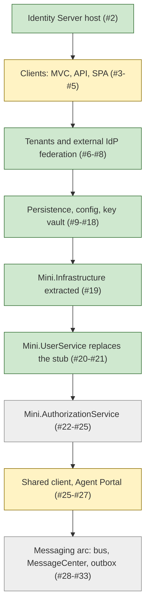

# Commit map of `stepwise_identity`

Task T013. Maps every commit of the primary source (`C:\MyWork\stepwise_identity`, 33 commits, branch history read with `git log --reverse` and `git show --stat`) to the new build plan in `specs/001-identity-platform-build/tasks.md` (repo `anchorpoint.identity.gateway`).

Read this first if you are new: the source is a **teaching repo**, one commit per "phase", each commit adding code, a phase README section and a `test-phaseNN.ps1` script. The new platform is **not** a port of it; it is a simplified rebuild on PostgreSQL / .NET 10 in separate repos. Use this map to find which source commit to read when you implement a given step.

Tracks: **C** = `anchorpoint.lib.infrastructure` (T030-T042), **U** = `anchorpoint.service.user` (T043-T056), **I** = `anchorpoint.identity.gateway` Identity Server (T057-T073), **M** = Tenant Middleware and **W** = Demo Web App (both deferred, no task ids yet; tasks.md "Deferred" section), **D** = docs/process tasks (T011-T029, T074-T091).

Legend for "Needed?": **now** = informs C/U/I tasks, **later** = informs deferred M/W work or backlog, **never** = out of scope for the 001 build (tasks.md "Source features left out").

Important caveat: "Purpose" is derived from the file list in `git show --stat` plus the commit's README line; I did not read every diff body (see "Not read / unverified"). Source stack is SQL Server + older .NET, so nothing is copied verbatim.

## 1. Full ordered commit table

| # | Commit | Purpose (from the diff) | Projects touched | Needed? | Maps to new step(s) / track |
|---|--------|-------------------------|------------------|---------|-----------------------------|
| 1 | `19fb8e0` Initial commit | `.gitignore` and a 2-line `README.md`. | repo root | never | none |
| 2 | `c467cbf` chore: idg phase 01 | Minimal Duende IdentityServer host: `Config.cs`, `Program.cs`, csproj, appsettings, `tempkey.jwk` (a committed dev key), 175-line README, solution file. | IdentityServerHost | now (pattern only) | T057 (scaffold, in-memory first), I. Do NOT copy `tempkey.jwk`; see T061, T086 |
| 3 | `38417a1` chore: phase 2 | Interactive login: `AccountController`, `TestUsers`, Login view in IdentityServerHost; new MvcClient (OIDC confidential client, Secure page); `test-phase2.ps1`. | IdentityServerHost, MvcClient | now / later | I: T057, T062 (login page); W later (MvcClient is the Demo Web App precedent) |
| 4 | `7f481a8` chore: phase 03 | Access tokens for an API: new SampleApi (JWT-protected), IdentityServerHost `Config.cs` gains API scope/resource, MvcClient calls the API (`ApiResult` view); `test-api.ps1`. | IdentityServerHost, MvcClient, SampleApi | later | C: T037 (JWT bearer + scope policy pattern); W later |
| 5 | `9d3e63f` chore : phase 04 | React SPA client (`ReactSpa`, Vite/TS) + SPA client config in `Config.cs`; SampleApi CORS tweak; `test-phase2-spa.ps1`, `test-spa-api.ps1`. | IdentityServerHost, MvcClient, SampleApi, ReactSpa | never | none (React SPA left out, tasks.md Deferred) |
| 6 | `1d3b0a8` chore: phase 05 | Multi-tenancy v1: `Tenants.cs`, `TenantContext`, `TenantResolutionMiddleware`, tenant-aware login; `test-phase3.ps1`. (README phase 3.) | IdentityServerHost | later | M: tenant resolution concept (Track M, Deferred); I: T062 only if tenant shows in login |
| 7 | `432db63` chore: phase 06 | Per-tenant federation to an external IdP: new `ExternalIdp` project (stand-in provider), `ExternalController`, `ExternalUserStore`, `SampleProfileService`, Azure Entra B2C setup doc; MvcClient tenant tweaks; `test-phase4.ps1`. (README phase 4.) | IdentityServerHost, ExternalIdp, MvcClient, ReactSpa | now | I: T062 (provider selection), T063 (port ExternalIdp as `Anchorpoint.ExternalIdp.Stub`), T065 (profile service) |
| 8 | `11b8d9a` chore: phase 06 | Refactor of #7: provider config moved into `Configurations/Authentication/*` (OpenIdConnect options, helpers, extensions); `external-providers-configuration.md`. (Still README phase 4.) | IdentityServerHost, ExternalIdp | now | I: T062 (adapt source phases 4 and 9, per tasks.md) |
| 9 | `80e58fb` chore: phase 07 | Multi-tenancy and external services in the clients: MvcClient `Infrastructure/{Configuration,Externals,MultiTenant}` (token client, `RequireTenant`), SampleApi `Infrastructure/Identity` (`IdentityContext`, `ServiceAccountOnlyFilter`), 435- and 357-line docs; two test scripts. | IdentityServerHost, MvcClient, ReactSpa, SampleApi | now (ideas) | C: T036 (client-credentials token client), T034 (context/correlation), T037 (scope policy); these are the later `Mini.Infrastructure` seeds (see #20) |
| 10 | `7711da7` chore: phase 08 | Local HTTPS/ports change across all launch settings; OIDC cookie correlation fix; `correlation-failed-troubleshooting.md`. | IdentityServerHost, ExternalIdp, MvcClient, ReactSpa, SampleApi | later | none directly; troubleshooting reference for T073 docs |
| 11 | `ba1cbcb` chore: phase 05 | Persistence on SQL Server: EF `ConfigurationDb`, `PersistedGrantDb`, `UserDb` with 3 Initial migrations, `SeedData`, `UserDbContext`; test scripts updated; `test-phase5.ps1`. (README phase 5.) | IdentityServerHost | now (design only) | I: T059 (config/operational store), T060 (seed). Migrations are SQL Server, must be regenerated for PostgreSQL (T059, T088) |
| 12 | `ed5e45d` docs: add CONTEXT.md... | `CONTEXT.md`, agent skills (`.claude/skills/stepwise-identity-phase`, `grill-with-docs`), `skills-lock.json`, .gitignore. No `src/`. | repo root | never (read for vocabulary) | D: T011 (glossary background), T076 |
| 13 | `acb54c0` chore: phase 06 | Config-driven setup: `Config.cs` (122 lines) deleted, replaced by `Configurations/IdentityServerConfig.json`; `SeedData` slimmed; new `Tools/ConfigIngestionTool`; `test-phase6.ps1`. (README phase 6.) | IdentityServerHost, MvcClient, SampleApi, ExternalIdp, Tools | later | I: T060 (seed from config) loosely; tool itself not needed |
| 14 | `a0d9d6d` chore: phase 07 | Identity Server calls "DIT" services: `ExternalServices/{TenantClient,UserClient,ExternalServicesOptions}`, richer `SampleProfileService` (claims from user lookup), `ExternalServicesStub` (hardcoded dictionaries); `test-phase7.ps1`. (README phase 7.) | IdentityServerHost, ExternalServicesStub, MvcClient, SampleApi | now | I: T064 (User Service client), T065 (IProfileService); tenant call = M later |
| 15 | `bce2879` chore: phase 08 | Signing keys from Azure Key Vault: `KeyManagement/*`, `docs/azure-key-vault-setup.md`; `test-phase8.ps1`. (README phase 8.) | IdentityServerHost | now (concept) | I: T061 (key supplied from outside repo; Key Vault reference allowed), T086 |
| 16 | `9569d73` docs: vendor-neutral OAuth/OIDC reference | `docs/reference/*` (6 protocol docs) + CONTEXT/README edits. | docs only | now (reading) | D: onboarding reading; T073, T077 may link to concepts |
| 17 | `e613a95` chore: phase conventions for the services arc | Edits only the phase-convention skill file. | `.claude/skills` | never | none |
| 18 | `96bb23c` chore: phase 09 | DB-persisted external providers: `IdentityProviderStore`, `DynamicIdentityProviderExtensions`, provider models, OIDC configure-options; ExternalIdp `Config.cs`; ConfigIngestionTool update; `test-phase9.ps1`. (README phase 9.) | IdentityServerHost, ExternalIdp, ExternalServicesStub, Tools | now | I: T062 ("providers persisted in the database; adapt source phases 4 and 9"), T059 |
| 19 | `920e449` chore: phase 10 | Extracts `Mini.Infrastructure` (first commit of it): moves `TokenClient`/`ExternalServicesConfiguration` to `ExternalServices/`, `Identity/*`, adds `Http/ResiliencePolicies.cs`; `run-all.ps1`; `docs/architecture/README.md`; consumers (IdentityServerHost, MvcClient, SampleApi) re-pointed; `test-phase10.ps1`. | Mini.Infrastructure, IdentityServerHost, MvcClient, SampleApi, ExternalIdp, ExternalServicesStub | now | C: T035 (resilience), T036 (service credentials), T034 (identity/correlation), T030 (packaging idea); see T014 inventory |
| 20 | `197629a` chore: phase 11 | Real `Mini.UserService` (minimal API + EF `ServiceDbContext`, `InitialUserServiceSchema` migration, user/tenant/management endpoints, `IdentityGatewayClient`); IdentityServerHost gains `UserConversionController` + `IdentityConversion`; first unit-test project `tests/StepwiseIdentity.Tests`; `docs/architecture/service-to-service-auth.md`; `test-phase11.ps1`. | Mini.UserService, IdentityServerHost, Mini.Infrastructure, ExternalServicesStub, Tools, tests | now | U: T043-T047 (scaffold/domain/data/seed), T051 (lookup endpoint), T052 (`user.read` auth); ADR-002 (T022); split decided in T016 (user vs tenant endpoints) |
| 21 | `f2cbca0` chore: phase 12 | Per-tenant cascading connectors in Mini.UserService (`Connectors/*`: `WebApiConnector`, handlers, `CascadingConnectorDbContext` + `InitialConnectorSchema`), new `Mini.AcmeApi` (tenant-owned system stand-in); `UserEndpoints` +194 lines; connector tests; `docs/architecture/connectors.md`; `test-phase12.ps1`. | Mini.UserService, Mini.AcmeApi, IdentityServerHost, Tools, tests | never (later maybe) | none in 001 (per-tenant connectors listed as left out); partial relevance to T016 split |
| 22 | `08de562` chore: phase 13 | New `Mini.AuthorizationService` (decision API, `AuthorizationDbContext`, migration); IdentityServerConfig tweak; `test-phase13.ps1`. | Mini.AuthorizationService, IdentityServerHost | later | none in 001; backlog only (T028) |
| 23 | `620813a` chore: phase 14 | `SampleApi` calls the authorization service (`AuthorizationClient`); `test-phase14.ps1`. | SampleApi, Mini.AuthorizationService | later | T028 backlog |
| 24 | `fde6003` chore: phase 15 | Persisted authorization decisions (`DecisionCache`, `AddCachedDecisions` migration), client update; `DecisionCacheTests`; `test-phase15.ps1`. | Mini.AuthorizationService, SampleApi, IdentityServerHost | later | T028 backlog; caching idea relevant to T053 (U-to-M cache decision) |
| 25 | `6fb3cd3` chore: phase 16 | `AuthorizationClient` moved into `Mini.Infrastructure/ExternalServices` and made resilient (SampleApi `appsettings` section); `test-phase16.ps1`. | Mini.Infrastructure, SampleApi | now (pattern) | C: T035/T036 (typed client + resilience + service auth as the shared pattern) |
| 26 | `41cde08` chore: phase 17 | `AgentPortal` skeleton (second MVC client, login only), IdentityServerConfig client entry; `test-phase17.ps1`. | AgentPortal, IdentityServerHost | later | W (Demo Web App); T060 (test client) as analogue |
| 27 | `b610003` chore: phase 18 | AgentPortal calls AuthorizationService via shared client; MultiTenant types (`ITenantContext`, `Tenant`, `RequireTenant`, middleware) moved from MvcClient into `Mini.Infrastructure/MultiTenant`; `AuthorizationDbContext` +33; `test-phase18.ps1`. | Mini.Infrastructure, AgentPortal, MvcClient, IdentityServerHost, Mini.AuthorizationService | later | M / W; shows where tenant context belongs in a shared lib (informs T014 and a future C step) |
| 28 | `d846055` chore: phase 19 | Message bus port into `Mini.Infrastructure/Messaging` (MassTransit/RabbitMQ options, `PolicyChangedEvent`), `docker-compose.yml`, `docs/adr/0001-messaging-transport.md`; `MessageBusTests`; `test-phase19.ps1`. | Mini.Infrastructure | never | none (message bus left out) |
| 29 | `660ed62` chore: phase 20 | New `Mini.MessageCenter` (consumes `PolicyChangedEvent`, webhook delivery, own DB + migration) and `WebhookReceiverStub`; `docs/architecture/webhooks.md`; tests; `test-phase20.ps1`. | Mini.MessageCenter, Mini.AcmeApi, WebhookReceiverStub | never | none (webhooks left out) |
| 30 | `5848ec5` chore: phase 21 | AuthorizationService policy-admin API + publishes `PolicyChangedEvent`; MessageCenter adjusted; `test-phase21.ps1`. | Mini.AuthorizationService, Mini.MessageCenter | never | none (T028 backlog at most) |
| 31 | `81fadf2` chore: phase 22 | AgentPortal gets its own EF DB (`PolicyChangeRequest`, migration) and policy edit/history UI via `PolicyAdminClient`; `test-phase22.ps1`. | AgentPortal, Mini.AuthorizationService | never | none |
| 32 | `2d961f2` chore: phase 23 | `PolicyAdminTenantGate` (tenant-match check) + tests; docs; `test-phase23.ps1`. | AgentPortal, Mini.AuthorizationService | never | none |
| 33 | `46e22bc` chore: phase 24 | Transactional outbox (`OutboxDispatcher`, `AddOutboxMessages` migration) in AuthorizationService; `ProcessedEvents` dedup in MessageCenter; small `PolicyChangedEvent` change in Mini.Infrastructure; tests; `test-phase24.ps1`. | Mini.AuthorizationService, Mini.MessageCenter, Mini.Infrastructure | never | none |

## 2. Per-project history

Same columns, only the commits that touched the project (`git log -- src/<Project>`); `#` is the row number from section 1. Purposes are repeated in short form, see section 1 for detail.

### 2.1 IdentityServerHost (23 commits) -> mainly Track I

| # | Commit | Purpose in this project | Needed? | Maps to |
|---|--------|-------------------------|---------|---------|
| 2 | `c467cbf` | Minimal host, in-memory config, committed dev key | now | T057, I |
| 3 | `38417a1` | Login controller, test users, login view | now | T057/T062, I |
| 4 | `7f481a8` | API scope/resource added to `Config.cs` | now | T060, I |
| 5 | `9d3e63f` | SPA client entry in `Config.cs` | never | none |
| 6 | `1d3b0a8` | Tenant resolution middleware, `Tenants.cs`, tenant-aware login | later | M; T062 partly |
| 7 | `432db63` | External IdP federation (`ExternalController`, `ExternalUserStore`, `SampleProfileService`) | now | T062, T063, T065, I |
| 8 | `11b8d9a` | Provider config refactor (`Configurations/Authentication`) | now | T062, I |
| 9 | `80e58fb` | Config.cs/README only for the clients' infrastructure phase | later | none |
| 10 | `7711da7` | Ports/HTTPS, correlation fix, troubleshooting doc | later | T073 docs |
| 11 | `ba1cbcb` | EF stores (Config, PersistedGrant, User) + SQL Server migrations + seed | now | T059, T060, I (regenerate for PostgreSQL) |
| 13 | `acb54c0` | Move config to `IdentityServerConfig.json`, drop `Config.cs` | later | T060 loosely |
| 14 | `a0d9d6d` | `TenantClient`/`UserClient`, profile service using lookups | now | T064, T065, I |
| 15 | `bce2879` | Key Vault key store (`KeyManagement/*`) | now | T061, I |
| 18 | `96bb23c` | `IdentityProviderStore`, dynamic providers in DB | now | T062, T059, I |
| 19 | `920e449` | Re-point to `Mini.Infrastructure`; csproj/Program wiring | now | T036, T064 (use LIB instead) |
| 20 | `197629a` | `UserConversionController`/`IdentityConversion` (supports Mini.UserService) | later | review for T016; probably not ported |
| 21 | `f2cbca0` | `UserClient` + profile service adjusted for connectors; config | never | none |
| 22 | `08de562` | Config JSON for authorization service | never | none |
| 23 | `620813a` | README line only | never | none |
| 24 | `fde6003` | Config JSON + README only | never | none |
| 25 | `6fb3cd3` | README only | never | none |
| 26 | `41cde08` | Config JSON: AgentPortal client | later | W; T060 analogue |
| 27 | `b610003` | Config JSON: client changes for AgentPortal | later | W |
| (note) | | In the per-project log the list above is by commit order; `ba1cbcb`/`acb54c0`/`a0d9d6d`/`bce2879` come after `7711da7` chronologically (see section 4). | | |

### 2.2 Mini.UserService (2 commits) -> Track U

| # | Commit | Purpose | Needed? | Maps to |
|---|--------|---------|---------|---------|
| 20 | `197629a` | Whole service: `ServiceDbContext` and one initial migration, `UserEndpoints`, `TenantEndpoints`, `ManagementEndpoints`, `IdentityGatewayClient`, `Program.cs` (165 lines), README, settings, unit tests (`IdentityContextTests`, `IdentityConversionTests`) | now | T043-T047, T051, T052, T054; T016 decides user vs tenant endpoints |
| 21 | `f2cbca0` | Connectors layer (`Connectors/*`, own DbContext/migration) and `UserEndpoints` +194 lines; connector tests | never | none in 001 |

### 2.3 Mini.Infrastructure (6 commits) -> Track C

| # | Commit | Purpose | Needed? | Maps to |
|---|--------|---------|---------|---------|
| 19 | `920e449` | Created: `ExternalServices/*` (TokenClient, ServiceAccount, config), `Identity/*`, `Http/ResiliencePolicies.cs` | now | T034, T035, T036 |
| 20 | `197629a` | README only (+51 lines) | later | T014 inventory |
| 25 | `6fb3cd3` | `ExternalServices/AuthorizationClient.cs` (resilient shared client) | now (pattern) | T035/T036 |
| 27 | `b610003` | Adds `MultiTenant/*` (ITenantContext, Tenant, RequireTenant, middleware) | later | future C or M step |
| 28 | `d846055` | Adds `Messaging/*` (bus extensions, options, `PolicyChangedEvent`), csproj | never | none |
| 33 | `46e22bc` | `PolicyChangedEvent` +12 lines for outbox | never | none |

Gaps vs the new library (T031, T032, T033, T037, T038, T039, T040, T041): the source `Mini.Infrastructure` has no logging, config-validation, error-model, health, observability, persistence or testing component in any commit; those are new work, not ports.

### 2.4 MvcClient (11 commits) -> Track W later

| # | Commit | Purpose | Needed? | Maps to |
|---|--------|---------|---------|---------|
| 3 | `38417a1` | Created: OIDC confidential client, Secure page, README | later | W |
| 4 | `7f481a8` | Calls SampleApi with access token | later | W |
| 5 | `9d3e63f` | README only | never | none |
| 6 | `1d3b0a8` | README only (tenant note) | never | none |
| 7 | `432db63` | Tenant/provider hint to login (Program, HomeController) | later | W |
| 9 | `80e58fb` | `Infrastructure/{Configuration,Externals,MultiTenant}` | later | W; ideas for C T036 |
| 10 | `7711da7` | Ports/HTTPS | never | none |
| 13 | `acb54c0` | README/doc edits | never | none |
| 14 | `a0d9d6d` | `ServiceAccount`/`TokenClient` tweak | never | none |
| 19 | `920e449` | Switches to `Mini.Infrastructure` | later | W |
| 27 | `b610003` | Removes its own MultiTenant types for the shared ones | later | W |

### 2.5 Other projects, briefly

| Project | Commits (row numbers) | Summary | Needed? / Maps to |
|---------|-----------------------|---------|-------------------|
| AgentPortal | 26 `41cde08`, 27 `b610003`, 31 `81fadf2`, 32 `2d961f2` | Second MVC client; calls AuthZ; later gets its own DB and policy UI | later (W only the skeleton); policy UI never |
| SampleApi | 4 `7f481a8`, 5 `9d3e63f`, 9 `80e58fb`, 10 `7711da7`, 13 `acb54c0`, 14 `a0d9d6d`, 19 `920e449`, 23 `620813a`, 24 `fde6003`, 25 `6fb3cd3` | Protected API; identity context; authorization client | later; `IdentityContext` ideas for T037 |
| ExternalIdp | 7 `432db63`, 8 `11b8d9a`, 10 `7711da7`, 13 `acb54c0`, 18 `96bb23c`, 19 `920e449` | Local stand-in external provider | now: T063 ports it |
| Mini.AuthorizationService | 22 `08de562`, 23, 24, 27, 30, 31, 32, 33 | Decision API, cache, policy admin, outbox | later / never (T028 backlog) |
| Mini.MessageCenter | 29 `660ed62`, 30 `5848ec5`, 33 `46e22bc` | Webhook fan-out consumer | never |

## 3. How the source evolved

Narrative:

1. Commits 2-10 grow one Identity Server and its clients (MVC, API, React SPA), then add tenants and federation to an external IdP. This is the material for Track I (T057, T062, T063, T065).
2. Commits 11-18 give the server persistence (SQL Server), config files, calls to "DIT" tenant and user services (still a hardcoded stub), signing keys in Key Vault and DB-stored providers (T059-T062, T064, T061).
3. Commit 19 (`920e449`) extracts the plumbing that nine commits had duplicated into `Mini.Infrastructure`; this is the origin of Track C (T034-T036).
4. Commits 20-21 replace the stub with a real `Mini.UserService` (Track U) and then add per-tenant connectors (not in scope).
5. Commits 22-33 add authorization, a second web client, a message bus, webhooks and an outbox. None of this is in the 001 build (message bus, outbox, webhooks, SPA, connectors are listed as left out in tasks.md).

## 4. Phases in the README with no matching commit, or commits spanning several phases

- **Commit labels do not equal README phases for the first 11 content commits.** The commit message numbers restart and drift: `38417a1` "phase 2" = README phase 2; `7f481a8` "phase 03" and `9d3e63f` "phase 04" are API and SPA additions to README phase 2 (clients); `1d3b0a8` "phase 05" is README phase 3 (multi-tenancy); `432db63` and `11b8d9a` both say "phase 06" and are README phase 4 (external IdPs); `80e58fb` "phase 07" and `7711da7` "phase 08" are extra multi-tenancy/external-services and ports fix work not listed as a README phase; the real README phases 5-8 then arrive as `ba1cbcb` "phase 05", `acb54c0` "phase 06", `a0d9d6d` "phase 07", `bce2879` "phase 08". Result: labels "05", "06", "07", "08" each occur twice (and "06" three times).
- **Commit order is not label order**: `ba1cbcb` "phase 05" comes after "phase 08" (`7711da7`) in history, so use the commit sequence, not the label, when checking out or reading in order.
- **README phases 14, 15, 16 have no title** in the list ("(authorization integration...)", etc.); they do map to one commit each (#23, #24, #25).
- **No commit adds `docs`-only content for README phase 1 separately**; `c467cbf` "idg phase 01" is the only one with the "idg" prefix.
- **Non-phase commits**: `ed5e45d`, `9569d73`, `e613a95` are docs/tooling; README lists 24 phases but there are 33 commits: 1 initial, 3 docs/tooling, and 29 phase-labelled commits. The extra 5 (`7f481a8`, `9d3e63f`, `80e58fb`, `7711da7`, `11b8d9a`) do not correspond to unique README phases.
- Several commits span more than one new component: `920e449` (extraction plus `run-all.ps1` plus architecture doc), `197629a` (UserService plus IdentityServer conversion plus unit-test project), `b610003` (AgentPortal feature plus moving MultiTenant into the shared lib).

## 5. Not read / unverified

- I read file stats (`git show --stat` equivalent via `git log --stat`) for all 33 commits but **did not read the diff bodies** of any commit. Purposes marked as "(from the diff)" are inferred from file names, sizes and the README text; verify before porting any code.
- Task id mappings use the task titles and the visible text of `tasks.md`; I did not check each task's full text against each source file. The T-numbers for M and W do not exist yet, so those rows say "M later" / "W later".
- Did not verify whether commit #20 `UserConversionController` is needed (decision belongs to T016).
- Did not check whether the source builds or tests pass.
- The working tree of `stepwise_identity` has one untracked file (`DIT-Objective-1-Legibility-Playbook.docx`); not part of any commit and not opened.
- AgentPortal, SampleApi, ExternalIdp, Mini.AuthorizationService and Mini.MessageCenter are covered briefly only, as requested.
