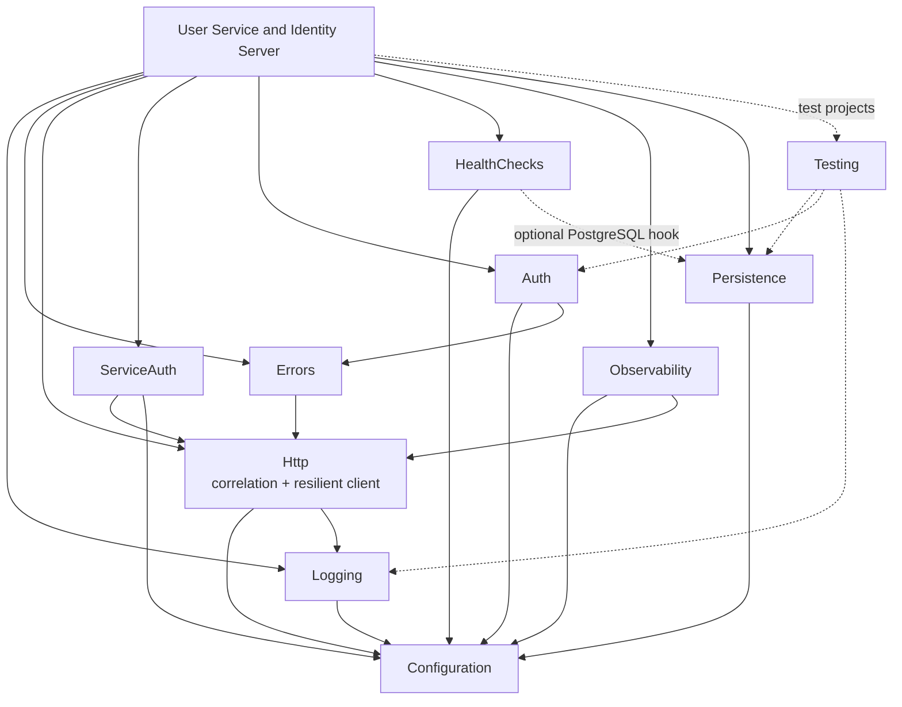

# Infrastructure inventory (T014)

Read-only discovery for the DIT identity platform program. Purpose: tell a new engineer which plumbing already exists where, what is genuinely duplicated, and what the new shared library (`anchorpoint.lib.infrastructure`, Track C) should contain in v0.1.0 so it does not become a "third divergent copy".

All paths are backticked on purpose (no relative links). "Unverified" means I did not confirm it by reading code or a manifest.

## 0. Sources and short names

| Short name | Root | Notes |
| --- | --- | --- |
| Mini | `C:\MyWork\stepwise_identity\src\Mini.Infrastructure` | Primary base for v0.1.0. net10.0, one csproj, folders `ExternalServices`, `Http`, `Identity`, `Messaging`, `MultiTenant`. README: `C:\MyWork\stepwise_identity\src\Mini.Infrastructure\README.md` |
| ACME | `C:\work\ACME.API.Middleware\src\AcmeMiddleware` (+ `AcmeMiddleware.Domain`) | net8.0, consumes `DigitalInsuranceTools.*` 6.3.0 packages |
| User | `C:\work\Services.User\src` | net10.0, `DITFrameworkVersion` 9.1.4 in `C:\work\Services.User\build\Versions.props` |
| IdG | `C:\work\Applications.IdentityGateway\src\Equisoft.IdentityGateway` | net8.0 (csproj), `DITFrameworkVersion` is used but its definition was not found in the repo (unverified: probably parent props or pipeline) |
| Lib | `C:\work\Libraries.Infrastructure\src` | Production library; package ids `DigitalInsuranceTools.*` (folders `DIT.*`) |

Plan source for v0.1.0: `C:\MyWork\Anchorpoint\anchorpoint.identity.gateway\specs\001-identity-platform-build\tasks.md` T030-T042.

Two facts that shape everything below:

1. Production services (ACME, User, IdG) contain very little plumbing of their own. They call `Lib` through its fluent builder (`services.AddDigitalInsuranceTools(config).AddLogging().AddWebApi()...`). The duplication is therefore mostly (a) small copies inside each service, (b) `Lib` vs `Mini` as two parallel designs, and (c) duplication inside `Lib` itself.
2. `Lib` has no PostgreSQL support, no generic OpenTelemetry exporter wiring, no correlation-ID component, no Testcontainers fixtures. Those v0.1.0 components have no production code to copy; they are new design.

## 1. Inventory table

Legend: `-` = nothing found. Classification is exactly "shared library" or "stays in a service". Release: v0.1.0 / later / never.

| Component | Mini.Infrastructure | ACME.API.Middleware | Services.User | IdentityGateway | Libraries.Infrastructure (project/package) | Classification | Target in the new library | Release | Notes |
| --- | --- | --- | --- | --- | --- | --- | --- | --- | --- |
| Structured logging (Serilog) | - | `Program.cs` `.UseLogging()` (old v6 API), `Startup.cs` `UseSerilogRequestLogging()` + `UseErrorLogger()` | `Startup.cs` `.AddLogging()`, `UseSerilogRequestLogging()` | `Startup.cs` `.AddLogging()`, `UseSerilogRequestLogging()` | `DIT.Logging` / `DigitalInsuranceTools.Logging` (`Extensions.cs`, `LoggerOptions.cs`, sinks Graylog/Seq/LoggingService/AppInsights, `Enrichers/DimensionSerilogEnricher.cs`) | shared library | `Anchorpoint.Infrastructure.Logging` | v0.1.0 | Lib reads section `logger`; console only in Development or container mode. Graylog/LoggingService/AppInsights sinks are Equisoft-specific, do not port. |
| Options binding / validation | `ExternalServices/ExternalServicesConfiguration.cs` (plain POCO, fallback logic, no validation) | `Startup.cs` many `services.Configure<T>(GetSection(..))`; static `Configuration.GetSection("Mocks").Bind(MocksSettings.Mocks)` | `Infrastructure/Options/BasicCredentialsOptions.cs` (defined, no other reference found in `src`) | `Configurations/Extensions/OptionsBuilderExtensions.cs` + `Startup.cs` lines 100-103 (`.Validate(..).ValidateOnStart()`) | `DigitalInsuranceTools` `Extensions.cs` `GetOptions<T>(section)` (bind only, no validation), `ConfigurationException.cs` | shared library | `Anchorpoint.Infrastructure.Configuration` | v0.1.0 | Only IdG validates and fails fast; nobody else does. Lib `GetOptions` silently returns defaults on a missing section. |
| Azure App Configuration / Key Vault config source | - | - | `Program.cs` `ConfigureAppConfiguration("user")` | `Configurations/AzureKeyVault/*`, `Configurations/Secrets/*` | `DigitalInsuranceTools/AppConfig/*` (`Azure.Identity`, `Microsoft.Azure.AppConfiguration.AspNetCore`) | stays in a service | service-local (guidance only in Configuration docs) | never | Azure specific. T032 only asks for "secret-source guidance". |
| Error model (result/error types) | - | `AcmeMiddleware.Domain/Exceptions/*` (NotFound, Forbidden, InvalidEntity, ExternalDependency) | `UserService.Domain/Exceptions/*` (AlreadyExist, ConfigurationValidation, ...) | `Infrastructure/Exceptions/*` | `DigitalInsuranceTools/Types/Exceptions/*` (NotFoundEntity, CreateEntity, ...), `DigitalInsuranceToolsException.cs` | shared library | `Anchorpoint.Infrastructure.Errors` | v0.1.0 | No `Result<T>` exists anywhere; exception types differ per service. The result model is new design. Domain-specific exception classes stay in services. |
| Exception to ProblemDetails middleware | `ServiceAccountOnlyFilter.cs` returns `Results.Problem`; `AddProblemDetails()` + `UseExceptionHandler()` live in consumers (`Mini.UserService\Program.cs` 125/145, `SampleApi\Program.cs` 88) | `Startup.cs` `ValidationProblemDetailsResult` for invalid model state | `Startup.cs` `app.UseProblemDetails()` | - (MVC error page `/Home/Error`) | `DIT.WebApi/ProblemDetails/*` (`ProblemDetailsMiddleware.cs`, `ProblemDetailsFactory.cs`, `ProblemDetailsOptions.cs`, `traceId` property) | shared library | `Anchorpoint.Infrastructure.Errors` | v0.1.0 | Lib is MVC-heavy (`IActionResultExecutor`, `ProblemDetailsFactory`). New one should be minimal-API friendly and carry `correlationId`. |
| Correlation IDs | - | `Startup.cs` `services.AddDefaultCorrelationId()` (namespace `CorrelationId.DependencyInjection`, a third-party package; unverified) | - | - | - (only `traceId` in ProblemDetails) | shared library | `Anchorpoint.Infrastructure.Http` | v0.1.0 | Only ACME has anything. No base code to copy. |
| Typed HTTP client + resilience | `Http/ResiliencePolicies.cs` (hardcoded: 2 retries 2s/4s; breaker 3 failures / 30s) | no Polly at all (grep); Refit clients with `.AddJwtForwarding()` in `Startup.cs` | `Infrastructure/Extensions/ServiceCollectionExtensions.cs` `AddServiceClient<IIdentityClientV1>(..)`; test-only Polly retry in `tests\UserService.IntegrationTests\Fixtures\DatabaseFixture.cs` | `Startup.cs` 217-223 `AddHttpClient<TenantClient>().AddRetryHandler(..).AddCircuitBreakerHandler(..)` | `DIT.HTTP` (`Rest/Polly/PolicyBuilder.cs`, `Rest/RestClient.cs`), `DIT.HTTP.AspNetCore/Extensions.cs` (`AddRetryHandler`, `AddCircuitBreakerHandler`, config `HttpClientOptions.Transient`), `DIT.HTTP.Refit` | shared library | `Anchorpoint.Infrastructure.Http` | v0.1.0 | Three retry implementations exist (Mini, `PolicyBuilder`, `AddRetryHandler`) with different numbers. See section 2. |
| Bearer-token forwarding handler | - (AgentPortal forwards manually, per Mini README) | `Infrastructure/UserJWTAccessor.cs`, `.AddJwtForwarding()` | `Startup.cs` `.ForwardJwt()` | - | `DIT.HTTP.AspNetCore/Handlers/JwtBearerForwarderHandler.cs` (also forwards `X-OnBehalfOf-*` headers) | shared library | `Anchorpoint.Infrastructure.Http` (add-on) | later | Not in the v0.1.0 list. Needed when a service calls another on behalf of the user. |
| Service credentials (client-credentials token client + cache) | `ExternalServices/TokenClient.cs`, `ITokenClient.cs`, `ServiceAccount.cs`, `ServiceDefinition.cs`, `ExternalServicesConfiguration.cs` | `AcmeMiddleware.Domain/Infrastructure/Clients/IServiceTokenClient.cs` (`ServiceTokenClient`), `Infrastructure/Clients/IServiceCollectionExtensions.cs` | `UserService.Data/V2/Repositories/TokenRepository.cs` (wrapper over Lib `ITokenClient`), `.AddTokenClient()` | `Data/Externals/Clients/TenantClient.cs` self-issues a JWT via Duende `IIdentityServerTools` (different mechanism) | `DIT.Identity/TokenClients/TokenClient.cs`, `FreshTokenClient.cs`, `TenantServiceAccountsOptions.cs`, `ClientSecret/*` (Key Vault), `Caching/DistributedTokenCache.cs` (Redis) | shared library | `Anchorpoint.Infrastructure.ServiceAuth` | v0.1.0 | Four client-credentials implementations: Mini, ACME, Lib, plus Mini's own note on the IdG self-issued variant. IdG's variant stays in IdG. |
| JWT bearer registration | repeated inline in consumers: `Mini.UserService\Program.cs` 37-51, `SampleApi\Program.cs` 17-35 (not extracted into Mini.Infrastructure) | `Startup.cs` `.AddJwt()` + cookie + OIDC | `Startup.cs` `.AddJwt().AddBasicAuth()` | `Startup.cs` `.AddBasicAuth()` + external providers + Duende local API | `DIT.Auth/Jwt/*` (`JwtAuthenticationBuilderExtensions.cs`, section `auth:jwt`, `JwtBearerDiagnostics*`) | shared library | `Anchorpoint.Infrastructure.Auth` | v0.1.0 | Mini's two inline copies set `MapInboundClaims = false`; Lib's `AddJwt` does not set it (grep found no `MapInboundClaims` in `src`). Behavioural difference to settle (see section 2). |
| Scope-based authorization policies | inline `AddPolicy(.. RequireClaim("scope", ..))` in `Mini.UserService\Program.cs` 53-90, `SampleApi\Program.cs` 37-43 | `Startup.cs` `HasScopeRequirement` from legacy package `InsuranceElements.Microservices.Libraries.Identity` | uses Lib | - | `DIT.Identity/Authorization/HasScopeRequirement.cs`, `HasScopeRequirementHandler.cs` | shared library | `Anchorpoint.Infrastructure.Auth` | v0.1.0 | Lib handler compares one `scope` claim per value; space-delimited scope strings are not split (unverified how tokens are shaped). |
| Identity context (who is calling) | `Identity/IIdentityContext.cs`, `IdentityContext.cs`, `IdentityContextMiddleware.cs`, `IdentityType.cs` | `Infrastructure/Clients/RequestIdentification.cs` (extension over Lib `IIdentityContext`) | `Infrastructure/Extensions/IdentityContextExtensions.cs` (`GetServiceAccountName`), `.AddIdentityContext()` | - | `DIT.Identity` (`IdentityContext.cs`, `IdentityPrincipalMiddleware.cs`, `IdentityPrincipalClaimDefaults.cs`, `IdentityType.cs` = None/User/Service) | shared library | `Anchorpoint.Infrastructure.Auth` | v0.1.0 | Mini source comments mention Guest and OnBehalfOf identity types; the current Lib `IdentityType.cs` only has None/User/Service. Mini's comment is stale or refers to another repo (unverified which). |
| Service-account-only gate | `Identity/ServiceAccountOnlyFilter.cs` (minimal API endpoint filter) | - | `Infrastructure/Authentication/ServiceAccountAuthorizeFilter.cs` (MVC filter) | - | - (Mini says it ports `Equisoft.AuthorizationService`'s filter; not in Lib) | shared library | `Anchorpoint.Infrastructure.Auth` | v0.1.0 | Two copies of the same rule in two styles. Prefer an authorization policy over a filter in the new lib. |
| Basic auth (health credentials) | - | `Startup.cs` `AddBasicAuth()`, `HealthCheckCredentials` | same | `AddBasicAuth()` | `DIT.Auth/Basic/*` (package `idunno.Authentication.Basic`) | stays in a service | service-local | never | Only used to protect health details. |
| Health checks | - | `Startup.cs` dummy `AddCheck("test", ..)` | `Startup.cs` `AddDatabaseHealthCheck`, `AddLoggingServiceHealthCheck`, `AddServiceHealthCheck(..)` | `Startup.cs` `AddDatabaseHealthCheck(..)` | `DIT.HealthChecks` (`HealthCheckMiddleware.cs` custom `/health` and `/health-details`, `Database/DbConnectionHealthCheck.cs`, `SqlConnectionHealthCheck.cs`, Redis, `Service/UrlHealthCheck.cs`) | shared library | `Anchorpoint.Infrastructure.HealthChecks` | v0.1.0 | Lib is SQL Server only and serializes with Newtonsoft. Needs liveness/readiness split and a Npgsql check. |
| OpenTelemetry / metrics | - | `Startup.cs` `.AddApplicationInsightsMetrics()` | same | same; plus `Infrastructure/Telemetry/SyntheticSourceFilter.cs` (classic App Insights `ITelemetryProcessor`) | `DIT.Metrics.ApplicationInsights` (`Azure.Monitor.OpenTelemetry.AspNetCore` 1.6.0, `Processors/*`, Redis and SqlClient instrumentation), `DIT.Diagnostics` | shared library | `Anchorpoint.Infrastructure.Observability` | v0.1.0 | Lib is bound to Azure Monitor and silently does nothing without a connection string. `SyntheticSourceFilter` stays in IdG. |
| EF Core persistence conventions | - (`AddDbContext(UseSqlServer)` inline in `Mini.UserService\Program.cs` 30) | - | `Startup.cs` `.AddEntityFrameworkSqlServer<ServiceDbContext>()` | `Startup.cs` `.AddEntityFrameworkSqlServer<UserDbContext>()` + Duende EF stores | `DIT.Persistence` (`DatabaseMigrationStartupTask.cs`), `DIT.Persistence.SqlServer` (`Extensions.cs`, tenant-aware connection string, `EnableRetryOnFailure`, seeding) | shared library | `Anchorpoint.Infrastructure.Persistence` | v0.1.0 | No Npgsql anywhere in `Lib`. snake_case/UUID/timestamptz conventions per tasks.md T040 are new. Lib's tenant-selected connection string is not needed in v0.1.0. |
| Database migration runner | - | - | `Infrastructure/Extensions/HostExtensions.cs` (`RunDatabaseMigrations<T>`); `Program.cs` arg `runDatabaseMigration` | `Infrastructure/Extensions/HostExtensions.cs` (byte-identical logic); `Program.cs` arg `runDatabaseMigration` | `DIT.Persistence/Extensions.cs` (`RunDatabaseMigrationsAsync`), `DatabaseMigrationStartupTask` | shared library | `Anchorpoint.Infrastructure.Persistence` (migration helper) | v0.1.0 | Same method pasted in User and IdG although Lib already has a startup-task version. |
| Test utilities | tests only: `C:\MyWork\stepwise_identity\tests\StepwiseIdentity.Tests` (EF InMemory, MassTransit test harness, xunit) | `tests\AcmeMiddleware.UnitTests` (not read) | `tests\UserService.IntegrationTests` (`Factories\IntegrationTestWebApplicationFactory.cs`, `Fixtures\DatabaseFixture.cs`, `Mocks\MockCollection.cs`) | `tests\...IntegrationTests\Fixtures\TestServerFixture.cs` (real Kestrel + Playwright) | `tests\DIT.HealthChecks.Tests\Common\WebApiFactory.cs`, `tests\DIT.Auth.Tests\Infrastructure\AuthenticationTestHost.cs`, `RecordingLoggerProvider.cs`, `tests\DIT.Logging.Tests\TestLogSink.cs`, `tests\DIT.Persistence.SqlServer.Tests\TestDbContext.cs` | shared library | `Anchorpoint.Infrastructure.Testing` | v0.1.0 | Testcontainers appears in none of the five code bases (grep). All DB fixtures use a pre-existing SQL Server or in-memory provider. Entirely new. |
| Multi-tenant context | `MultiTenant/*` (claims-based `ITenantContext`, `RequireTenantAttribute`, `Tenants`) | uses Lib `IIdentityContext.Tenant` | `.AddIdentityContext()`; Lib `ITenantContext` | `Infrastructure/Tenant/TenantAccessor.cs` (IdP to ecosystem tenant lookup) | `DIT.Identity/ITenantContext.cs`, `TenantContext.cs` | shared library | `Anchorpoint.Infrastructure.MultiTenant` | later | Deferred per brief. Mini README argues the two `TenantContext`s must not be merged; IdG's `TenantAccessor` stays in IdG. |
| Messaging | `Messaging/*` (MassTransit 8.3.4, RabbitMQ/InMemory) | `Consumers/*`, `.AddMessageQueue(..)` | `.AddMessageQueue()` | `.AddMessageQueue()` | `DIT.MessageQueue` (MassTransit 8.5.7 incl. Azure Service Bus, Newtonsoft) | shared library | `Anchorpoint.Infrastructure.Messaging` | later | Deferred per brief. MassTransit licensing of newer major versions: unverified, check before adopting. |
| Authorization client | `ExternalServices/AuthorizationClient.cs` | `Infrastructure/Clients/AuthorizationClient.cs`, `Infrastructure/Authorization/Handlers/PermissionsHandler.cs`, `Equisoft.AuthorizationService.Client` 3.0.0 | `AddAuthorizationApi<..>`, `AddAuthorizationPermissionPolicies()` | - | `DIT.Authorization.Client` (Refit) | shared library | `Anchorpoint.Infrastructure.AuthorizationClient` | later | Deferred per brief. |
| Swagger / API versioning | `SampleApi` uses `Asp.Versioning` inline | `Startup.cs` `AddVersioning()`, `AddSwaggerDocs(..)` | `AddSwaggerDocs()` | - | `DIT.Docs.Swagger` (Swashbuckle 10.2.3, Asp.Versioning 10.2.1) | shared library | `Anchorpoint.Infrastructure.WebApi` (candidate) | later | Not in v0.1.0 list; revisit when two services need OpenAPI output. |
| CORS / API root / no-cache | inline in `SampleApi\Program.cs` (~line 92) | `Startup.cs` CORS | `UseCors()`, `UseApiRoot()` | wildcard CORS service in IdG | `DIT.WebApi/Cors/*`, `Middlewares/ApiRootHandlerMiddleware.cs`, `Filters/NoCacheFilterAttribute.cs` | stays in a service | service-local | never | Browser-facing policies are per-service. Revisit only if a shared default is wanted. |
| Host bootstrap / startup tasks | - | `Program.cs` `new Bootstrapper().Run(host)` | `Program.cs` `Bootstrapper.RunAsync` | `Program.cs` `Bootstrapper.Run`, `IStartupTask` | `DigitalInsuranceTools/Bootstrapper.cs`, `DigitalInsuranceToolsBuilder.cs`, `DIT.WebApi/DITWebHost.cs` | stays in a service | service-local (plain `WebApplication` host) | never | The fluent `IDigitalInsuranceToolsBuilder` + `Startup.cs` model should not be reproduced in a .NET 10 minimal-hosting code base. |
| Feature flags | - | - | `AddSplitFeatureFlags()` | - | `DIT.Extensions.FeatureFlags(.Provider.Split)` | stays in a service | service-local | never | Not required by the platform plan. |
| Audit | - | - | `AddAudit()` | `AddAudit()` | `DIT.Audit(.Abstractions)` (MassTransit based) | stays in a service | service-local | never | Depends on messaging; revisit after messaging exists. |
| Redis cache / Cosmos | - | - | `AddRedis("userapi")` | Redis cache extension (`Configurations/Extensions/CachingExtensions.cs`) | `DIT.Persistence.Redis`, `DIT.Persistence.Cosmos` | stays in a service | service-local | never | Platform uses PostgreSQL; v0.1.0 token cache is in-memory (T036). |
| Connectors | `Mini.UserService` (Phase 12 port, outside Mini.Infrastructure) | - | `UserService.Services/V2/Connectors/*`, handlers | - | `DIT.Connectors.Domain/Data/HTTP/AspNetCore` | stays in a service | service-local (User Service) | never | Domain feature of the User Service, not plumbing. |
| Identity-server host concerns | - | - | - | Duende, SAML (`ComponentSpace.Saml2.Licensed`), `Configurations/Certificates/*`, `CookieSession/*`, `CleanUpExpiredTokensHostedService.cs`, localization, NWebsec CSP | - | stays in a service | service-local (Identity Server) | never | Not shared plumbing. |
| Service locator `Provider<T>` | - | - | `Infrastructure/Provider.cs` | - | - | stays in a service | service-local | never | Anti-pattern; do not promote. |
| `ISystemClock` registration | - | - | `ServiceCollectionExtensions.cs` `AddSystemClock()` | - | - | stays in a service | service-local | never | Use `TimeProvider` in .NET 10 instead. |
| HTTP error-log scope helper | - | - | - | `Configurations/Extensions/LoggerExtension.cs` (`LogErrorWithHttpResponse`) | `DIT.HTTP.AspNetCore/Extensions.cs` private `BuildLogContextAsync` | shared library | `Anchorpoint.Infrastructure.Http` (internal to the resilience logging) | v0.1.0 | Same idea written twice. Lib's version logs the full response body; IdG's strips `Authorization` header. Do the IdG redaction. |

## 2. Per v0.1.0 component: source files and duplication found

Convention: primary = copy/adapt from Mini (already .NET 10, small, clean); design reference = Lib (read for behaviour and options shape, do not copy, see section 3).

### 2.1 Logging (`Anchorpoint.Infrastructure.Logging`, T031)

- Primary: no Mini code. Start from Serilog's own `AddSerilog` hosting API.
- Design reference: `C:\work\Libraries.Infrastructure\src\DIT.Logging\Extensions.cs`, `LoggerOptions.cs`, `LoggingLevelSwitches.cs`, `Enrichers\DimensionSerilogEnricher.cs`; tests `C:\work\Libraries.Infrastructure\tests\DIT.Logging.Tests\TestLogSink.cs`.
- Duplication/divergence found:
  - ACME uses an older host-level `.UseLogging()` plus `UseErrorLogger()` (`C:\work\ACME.API.Middleware\src\AcmeMiddleware\Program.cs`, `Startup.cs`); User and IdG use the builder `.AddLogging()` (`C:\work\Services.User\src\UserService\Startup.cs`, `C:\work\Applications.IdentityGateway\src\Equisoft.IdentityGateway\Startup.cs`). Same concept, two API generations.
  - `UseSerilogRequestLogging()` is called by hand in all three services.
  - `Services.User` integration tests have to stub `Serilog.ILogger` and `IDiagnosticContext` to boot (`C:\work\Services.User\tests\UserService.IntegrationTests\Factories\IntegrationTestWebApplicationFactory.cs`). The new component should be bootable in tests without that.
- Library should own: one `AddAnchorpointLogging` + `UseAnchorpointRequestLogging`, correlation ID enrichment (T031), console JSON in containers.

### 2.2 Configuration (`...Configuration`, T032)

- Primary: `C:\MyWork\stepwise_identity\src\Mini.Infrastructure\ExternalServices\ExternalServicesConfiguration.cs` for the shape of config POCOs.
- Design reference: `C:\work\Libraries.Infrastructure\src\DigitalInsuranceTools\Extensions.cs` (`GetOptions<T>`), `C:\work\Applications.IdentityGateway\src\Equisoft.IdentityGateway\Configurations\Extensions\OptionsBuilderExtensions.cs` (the only fail-fast validation found, `Startup.cs` lines 100-103).
- Duplication/divergence found: bind-without-validation in Lib, ACME (`Startup.cs` many `Configure<T>`) and User; validation only in IdG; unused `BasicCredentialsOptions` in User (`C:\work\Services.User\src\UserService\Infrastructure\Options\BasicCredentialsOptions.cs`).
- Library should own: `AddValidatedOptions<T>(section)` using `ValidateDataAnnotations().ValidateOnStart()`.

### 2.3 Error handling (`...Errors`, T033)

- Primary: `Mini.Infrastructure\Identity\ServiceAccountOnlyFilter.cs` (uses `Results.Problem`); consumers' `AddProblemDetails()`/`UseExceptionHandler()` (`C:\MyWork\stepwise_identity\src\SampleApi\Program.cs` 88, `Mini.UserService\Program.cs` 125/145).
- Design reference: `C:\work\Libraries.Infrastructure\src\DIT.WebApi\ProblemDetails\ProblemDetailsMiddleware.cs`, `ProblemDetailsFactory.cs`, `ProblemDetailsOptions.cs` (traceId, exception-details only in Development, header allow-list), `ValidationProblemDetailsResult.cs`.
- Duplication/divergence found: exception types re-declared per service (ACME `Domain\Exceptions`, User `Domain\Exceptions`, Lib `Types\Exceptions`); ACME wires `ValidationProblemDetailsResult` by hand; Mini notes (in `SampleApi\Program.cs`) that `AddProblemDetails()` does not add a body to JWT 401 challenges. No code base has a result type.
- Library should own: `Result`/`Error` types, one exception-to-ProblemDetails middleware, and a stable `correlationId` extension field.

### 2.4 Correlation IDs (`...Http`, part 1, T034)

- Primary: none. Only ACME has any (`C:\work\ACME.API.Middleware\src\AcmeMiddleware\Startup.cs`, `AddDefaultCorrelationId()` from a third-party package; unverified package name).
- Design reference: `traceId` handling in `ProblemDetailsOptions.cs` (Lib).
- Duplication found: none (absence is the finding). Risk: if each service adds its own, divergence starts here. Library owns inbound middleware, `DelegatingHandler` propagation, and Serilog enrichment.

### 2.5 Typed HTTP client with resilience (`...Http`, part 2, T035)

- Primary: `C:\MyWork\stepwise_identity\src\Mini.Infrastructure\Http\ResiliencePolicies.cs` (as named in T035).
- Design reference: `C:\work\Libraries.Infrastructure\src\DIT.HTTP.AspNetCore\Extensions.cs` (`AddRetryHandler`, `AddCircuitBreakerHandler`, `HttpClientOptions.Transient`), `DIT.HTTP\Options\HttpClientOptions.cs`, `DIT.HTTP\Options\ServiceClientOptions.cs`.
- Duplication/divergence found (three retry designs, none with a timeout):

| Source | Retries | Backoff | Breaker | Config |
| --- | --- | --- | --- | --- |
| Mini `Http\ResiliencePolicies.cs` | 2 | 2^n s (2s, 4s) | 3 failures, 30 s | hardcoded |
| Lib `DIT.HTTP\Rest\Polly\PolicyBuilder.cs` | 3 | 2^n s + jitter 0-100 ms | none | hardcoded |
| Lib `DIT.HTTP.AspNetCore\Extensions.cs` | `Transient.Retries` (default 3) | 2^n s + jitter | `Retries+1` failures, `BreakDuration` (default 30 s) | options; opt-in via `Transient.Enabled` |

  - IdG consumes the Lib handlers (`C:\work\Applications.IdentityGateway\src\Equisoft.IdentityGateway\Startup.cs` 217-223); User consumes them through `AddServiceClient<T>` (Refit); ACME has no resilience.
  - Inside Lib, the three `ServiceClientOptions`/`HttpClientOptions` copy blocks in `DIT.HTTP.Refit\Extensions.cs` and `DIT.HTTP.AspNetCore\Extensions.cs` carry "Todo: can this be improved?"; the retry log always uses `ILogger<DigitalInsuranceToolsXmlHttpClient>` even for non-XML clients.
  - Both Mini and Lib use the legacy Polly v7 style (`Microsoft.Extensions.Http.Polly`, `HttpPolicyExtensions`). Whether to use `Microsoft.Extensions.Http.Resilience` (Polly v8) instead is an open design decision for T035 (unverified which Polly major the planned tests/consumers need).
- Library should own: one options-driven pipeline (timeout, jittered retry, breaker) applied through a single `AddAnchorpointHttpClient<T>` extension; defaults from the Mini numbers or the Lib defaults, documented once. A circuit-breaker window pitfall is already documented in Mini's `ResiliencePolicies.cs` comments (a restarted dependency still looks down for 30 s); keep it in `docs/components/http-client.md`.

### 2.6 Service credentials (`...ServiceAuth`, T036)

- Primary: `C:\MyWork\stepwise_identity\src\Mini.Infrastructure\ExternalServices\TokenClient.cs`, `ITokenClient.cs`, `ServiceAccount.cs`, `ServiceDefinition.cs`, `ExternalServicesConfiguration.cs`.
- Design reference: `C:\work\Libraries.Infrastructure\src\DIT.Identity\TokenClients\TokenClient.cs`, `TokenClientException.cs`, `TenantServiceAccountsOptions.cs`.
- Duplication/divergence found:

| Source | Cache | TTL | Secret source | client_id |
| --- | --- | --- | --- | --- |
| Mini `TokenClient.cs` | `IMemoryCache` | `expires_in - 30 s`, min 30 s | config dictionary per tenant | `{ClientId}.{tenant}` |
| ACME `AcmeMiddleware.Domain\Infrastructure\Clients\IServiceTokenClient.cs` | `IMemoryCache` | `expires_in - 1 s` | config dictionary | `{PrincipalPrefix}.{tenant}` |
| Lib `TokenClient.cs` | Redis via `IServiceCacheManager` | 90 percent of lifetime | `IClientSecretProvider` (config or Key Vault) | `{PrincipalPrefix}.{tenant}` |
| IdG `Data\Externals\Clients\TenantClient.cs` | none | 60 s self-issued | none (Duende key) | `JwtAuthentication.ClientId` |

  - ACME's copy has an unreachable second `IsError` check (read of `ServiceTokenClient`), and returns an error object instead of throwing; Mini throws `InvalidOperationException`; Lib throws `TokenClientException`. Three error contracts.
  - Mini's TTL (30 s margin) is the safest of the three; ACME's 1 s margin risks mid-flight expiry.
  - T036 targets Mini's design. Decide up front whether the tenant dimension stays (platform is multi-tenant but the plan defers the multi-tenant context). Keep a plain `clientId` + secret overload so v0.1.0 does not drag in tenant concepts (design suggestion, unverified against spec).

### 2.7 Auth helpers (`...Auth`, T037)

- Primary: `C:\MyWork\stepwise_identity\src\Mini.Infrastructure\Identity\IIdentityContext.cs`, `IdentityContext.cs`, `IdentityContextMiddleware.cs`, `IdentityType.cs`, `ServiceAccountOnlyFilter.cs`, plus the inline JWT/policy code in `C:\MyWork\stepwise_identity\src\Mini.UserService\Program.cs` (lines 30-90) and `C:\MyWork\stepwise_identity\src\SampleApi\Program.cs` (lines 12-43), which was never extracted.
- Design reference: `C:\work\Libraries.Infrastructure\src\DIT.Auth\Jwt\JwtAuthenticationBuilderExtensions.cs`, `JwtAuthenticationOptions.cs`, `Jwt\Diagnostics\*`; `DIT.Identity\Authorization\HasScopeRequirement*.cs`, `IdentityContext.cs`, `IdentityPrincipalMiddleware.cs`.
- Duplication/divergence found:
  - JWT bearer registration is pasted twice in Mini consumers and once more as Lib `AddJwt`; Mini sets `MapInboundClaims = false` for a documented reason (otherwise `sub` is remapped and every user is classified as a service). Lib's `AddJwt` does not set it (grep). Decide and test this explicitly.
  - Scope check implemented three ways: Mini `RequireClaim("scope", ..)`, Lib `HasScopeRequirementHandler`, ACME legacy `HasScopeRequirement` from `InsuranceElements.Microservices.Libraries.Identity`.
  - Service-only gate implemented twice: `Mini.Infrastructure\Identity\ServiceAccountOnlyFilter.cs` (endpoint filter) and `C:\work\Services.User\src\UserService\Infrastructure\Authentication\ServiceAccountAuthorizeFilter.cs` (MVC filter).
  - Mini decides User vs Service by absence of `sub`; Lib uses explicit service claims (`IdentityPrincipalClaimDefaults.cs`). The Identity Server (Track I) must agree with whichever rule the library implements.
- Library should own: `AddAnchorpointJwtBearer`, `AddScopePolicy("name", "scope")`, `IIdentityContext` + middleware, a "service caller only" policy (not a filter).

### 2.8 Health checks (`...HealthChecks`, T038)

- Primary: none in Mini.
- Design reference: `C:\work\Libraries.Infrastructure\src\DIT.HealthChecks\HealthCheckMiddleware.cs`, `HealthChecksDefaults.cs` (`/health`, `/health-details`), `Database\DbConnectionHealthCheck.cs`; tests `C:\work\Libraries.Infrastructure\tests\DIT.HealthChecks.Tests\Common\WebApiFactory.cs`.
- Duplication/divergence found: User and IdG register database checks the same way through Lib; ACME has a placeholder `AddCheck("test", ..)` (`C:\work\ACME.API.Middleware\src\AcmeMiddleware\Startup.cs`). Lib's middleware is a custom replacement for the built-in endpoint mapping, with Newtonsoft and optional Basic/JWT protection. Plan wants liveness and readiness plus a PostgreSQL hook: use ASP.NET Core `MapHealthChecks` with tags; no code to copy beyond the endpoint naming idea.

### 2.9 Observability (`...Observability`, T039)

- Primary: none in Mini.
- Design reference: `C:\work\Libraries.Infrastructure\src\DIT.Metrics.ApplicationInsights\Extensions.cs`, `Processors\*`, `StaticTelemetryDimensions.cs`; `DIT.Identity\Telemetry\*`.
- Duplication/divergence found: all three services call the same `AddApplicationInsightsMetrics()`; IdG additionally keeps a classic App Insights `SyntheticSourceFilter` (`C:\work\Applications.IdentityGateway\src\Equisoft.IdentityGateway\Infrastructure\Telemetry\SyntheticSourceFilter.cs`), a leftover from before the OpenTelemetry move. New component must be exporter-neutral (T039: "exporter configured externally"); Lib's cloud-role-name and dimension logic is the reusable idea.

### 2.10 Persistence (`...Persistence`, T040)

- Primary: none in Mini (`C:\MyWork\stepwise_identity\src\Mini.UserService\Program.cs` line 30 registers `AddDbContext` inline with SQL Server).
- Design reference: `C:\work\Libraries.Infrastructure\src\DIT.Persistence\*`, `DIT.Persistence.SqlServer\Extensions.cs`, tests `C:\work\Libraries.Infrastructure\tests\DIT.Persistence.SqlServer.Tests\TestMigrator.cs`.
- Duplication found: `RunDatabaseMigrations<TContext>` is identical in `C:\work\Services.User\src\UserService\Infrastructure\Extensions\HostExtensions.cs` and `C:\work\Applications.IdentityGateway\src\Equisoft.IdentityGateway\Infrastructure\Extensions\HostExtensions.cs`, while Lib already ships a startup-task migration runner. IdG's `Program.cs` and User's `Program.cs` each parse the `runDatabaseMigration` argument by hand. Library should own one migration helper (explicit CLI/hosted mode, not auto-migrate on every start). Npgsql, snake_case, UUID and `timestamptz` conventions: nothing exists in any source; ADR-005 referenced by T040 was not read.

### 2.11 Test utilities (`...Testing`, T041)

- Primary: none in Mini (its tests use EF InMemory and MassTransit's harness).
- Design reference: `C:\work\Services.User\tests\UserService.IntegrationTests\Factories\IntegrationTestWebApplicationFactory.cs` (service-swap helper `services.Swap(..)` in `Extensions\`), `Fixtures\DatabaseFixture.cs`, `C:\work\Libraries.Infrastructure\tests\DIT.Auth.Tests\Infrastructure\AuthenticationTestHost.cs`, `RecordingLoggerProvider.cs`.
- Duplication found: User and IdG each wrote their own `WebApplicationFactory` subclass (`TestServerFixture.cs` in IdG contains the comment "Fake Server we won't use...this is lame"); Lib's tests have two more (`WebApiFactory.cs`, `AuthenticationTestHost.cs`). No Testcontainers, no fake token issuer anywhere. The User fixture recreates the DB with `EnsureDeleted`/`EnsureCreated`, whereas T041 requires applying real migrations on a fresh database.

## 3. Licensing, porting constraints, packages and target frameworks (Libraries.Infrastructure)

### 3.1 Licensing and porting

| Item | Evidence | Constraint |
| --- | --- | --- |
| Proprietary copyright | `C:\work\Libraries.Infrastructure\README.md` "Copyright (c) Equisoft. All rights reserved."; `Directory.Build.props` `Copyright (c) 2026 Equisoft. All rights reserved.` | No open-source license file found in the repo root (listing showed none). The new library is MIT with a personal copyright holder (`C:\MyWork\Anchorpoint\anchorpoint.lib.infrastructure\LICENSE`). Copying `Lib` source into it is a legal question; treat `Lib` as a design reference only and write original code. Get an explicit decision from the program owner if any file is to be lifted verbatim (unverified legal position). |
| Third-party code inside Lib | `C:\work\Libraries.Infrastructure\src\DIT.HealthChecks\Database\DbConnectionHealthCheck.cs` carries a `.NET Foundation` Apache-2.0 header (only file in `src` with such a header, per grep) | If ever ported, the Apache-2.0 notice must be preserved; simpler to use the framework health-check API instead. |
| Mini as a source | `Mini` is in a personal sample repo and says it is a port of `Lib` and of Apply/Authorization service code (comments in `TokenClient.cs`, `IdentityContext.cs`, `ServiceAccountOnlyFilter.cs`) | Mini itself inherits the same provenance question. Same rule: base on its design, rewrite, do not paste unreviewed. (Unverified whether Mini's repo has a license; not checked.) |
| Internal feed | `C:\work\Libraries.Infrastructure\NuGet.Config` points to an Azure DevOps feed `EquisoftOrganization/.../Libraries` | Packages are not publicly installable; the new library must not depend on `DigitalInsuranceTools.*` packages. |

### 3.2 Target frameworks and versions

| Item | Value | Note |
| --- | --- | --- |
| `Lib` TFM | all `src` projects `net10.0` (csproj); `LangVersion` 14.0; `TreatWarningsAsErrors` true | `bin\Debug` folders still contain `net8.0` outputs and the changelog says ".NET 8 to .NET 10" (`C:\work\Libraries.Infrastructure\docs\gettingStarted\changelog.md`); stale artifacts, not a current multi-target (unverified, no `TargetFrameworks` found). Uses C# 14 `extension(IHost host)` syntax in `DIT.Persistence\Extensions.cs`. |
| Package version in docs | `DigitalInsuranceTools` 10.0.0 (`docs\gettingStarted\installation.md`) | Versioned in lockstep with the .NET major. |
| `Mini` TFM | `net10.0`, Polly via `Microsoft.Extensions.Http.Polly` 10.0.11, `IdentityModel` 7.0.0, MassTransit 8.3.4 | Lib uses 10.0.10, `IdentityModel` 7.0.0, MassTransit 8.5.7. |
| Consumers (not .NET 10 or not on current Lib) | ACME `net8.0`, `DigitalInsuranceTools.*` 6.3.0, `Refit` 9.0.2; IdG `net8.0`; User `net10.0` with Lib 9.1.4 | These show Lib's API drift: ACME's `.UseLogging()`/`UseErrorLogger()` do not exist in current `Lib` `src` (grep found no `UseErrorLogger`). Never copy from ACME without checking against current Lib. |
| New library | `net10.0`, `LangVersion latest`, `Nullable` enabled | `C:\MyWork\Anchorpoint\anchorpoint.lib.infrastructure\Directory.Build.props`. |

### 3.3 Package dependencies noticed in Lib

| Package | Used by (project) | Remark for the new library |
| --- | --- | --- |
| Serilog.AspNetCore 10.0.0, Serilog.Sinks.Console 6.1.1, Serilog.Exceptions 8.4.0, Serilog.Enrichers.Environment 3.0.1, Serilog.Formatting.Compact 3.0.0 | `DIT.Logging` | Fine to reuse (open source). |
| Serilog.Sinks.Graylog 3.1.1, Serilog.Sinks.Http 9.2.1, Serilog.Sinks.Seq 9.1.0 | `DIT.Logging` | Skip; sinks are deployment choices. |
| Microsoft.Extensions.Http.Polly 10.0.10 | `DIT.HTTP` | Legacy Polly style; see section 2.5. |
| Refit 15.0.0 (+ HttpClientFactory, Xml) | `DIT.HTTP.Refit`, `DIT.Authorization.Client` | Not in v0.1.0 plan; Refit is not required. |
| Microsoft.AspNetCore.Authentication.JwtBearer 10.0.10, Microsoft.IdentityModel.* 8.22.0, idunno.Authentication.Basic 2.4.0 | `DIT.Auth` | JwtBearer yes; Basic no. |
| IdentityModel 7.0.0, Azure.Identity 1.21.0, Azure.Security.KeyVault.Secrets 4.11.0 | `DIT.Identity` | IdentityModel is also in Mini (client-credentials request). Key Vault: later. |
| Azure.Monitor.OpenTelemetry.AspNetCore 1.6.0, OpenTelemetry.Instrumentation.SqlClient 1.17.0, OpenTelemetry.Instrumentation.StackExchangeRedis 1.15.0-beta.1 | `DIT.Metrics.ApplicationInsights` | Replace with exporter-neutral OpenTelemetry packages + Npgsql instrumentation (unverified exact package set). Note a pre-release package in Lib. |
| Microsoft.EntityFrameworkCore(.SqlServer) 10.0.10, Microsoft.Data.SqlClient 7.0.2 | `DIT.Persistence.SqlServer`, `DIT.HealthChecks` | Replace with Npgsql provider. |
| AspNetCore.HealthChecks.Redis 9.0.0, AspNetCore.HealthChecks.Uris 9.0.0, Newtonsoft.Json 13.0.4 | `DIT.HealthChecks` | Avoid Newtonsoft in the new library (use System.Text.Json). |
| Asp.Versioning.Mvc.ApiExplorer 10.2.1, Swashbuckle.AspNetCore 10.2.3 | `DIT.WebApi`, `DIT.Docs.Swagger` | Later. |
| MassTransit 8.5.7 (+ Azure Service Bus, RabbitMQ, Newtonsoft) | `DIT.MessageQueue`, `DIT.Audit` | Later. Newer MassTransit majors may have changed licensing (from memory, unverified). |
| Figgle.Fonts 0.6.6, Microsoft.Azure.AppConfiguration.AspNetCore 8.6.0 | `DigitalInsuranceTools` | Banner and Azure App Config; not needed. |
| Dependency shape | Nearly every `Lib` project references `DigitalInsuranceTools` (the core with Azure packages) and often `DIT.Identity` (which references Redis persistence) | Consumers get Azure and Redis transitively. The new library should keep components independent so v0.1.0 consumers only pull what they use. |

## 4. Recommended layout of the new library

Repository: `C:\MyWork\Anchorpoint\anchorpoint.lib.infrastructure` (currently has `Directory.Build.props`, `LICENSE`, `README.md`, `CHANGELOG.md`, `anchorpoint.lib.infrastructure.slnx`, `docs`, `global.json`; no `src` yet). Names follow tasks.md T031-T041.

```text
src/
  Anchorpoint.Infrastructure.Logging/
  Anchorpoint.Infrastructure.Configuration/
  Anchorpoint.Infrastructure.Errors/
  Anchorpoint.Infrastructure.Http/            correlation (T034) + typed client resilience (T035)
  Anchorpoint.Infrastructure.ServiceAuth/     client-credentials token client + cache (T036)
  Anchorpoint.Infrastructure.Auth/            JWT bearer, scope policies, identity context (T037)
  Anchorpoint.Infrastructure.HealthChecks/
  Anchorpoint.Infrastructure.Observability/
  Anchorpoint.Infrastructure.Persistence/
  Anchorpoint.Infrastructure.Testing/
tests/
  Anchorpoint.Infrastructure.<Component>.Tests/   one per component
```

Design rules suggested by the findings (design suggestions, not decisions):

1. One package per component; no umbrella core that drags Azure or Redis (contrast with `DigitalInsuranceTools`).
2. Plain `IServiceCollection` / `IApplicationBuilder` extension methods, no `IDigitalInsuranceToolsBuilder`, no `Startup.cs` assumption.
3. `Configuration` is a leaf dependency used by the others for options validation.
4. `Errors` depends on nothing but ASP.NET Core; `Http` and `Logging` take correlation from one place.
5. Deferred components (`MultiTenant`, `Messaging`, `AuthorizationClient`) must not appear as empty projects in v0.1.0.



Dependency notes: arrows mean "depends on". `Errors --> Http` exists only so `correlationId` comes from the correlation middleware; if that coupling is unwanted, put correlation in a tiny shared abstraction inside `Errors` or `Logging` instead (open design question).

## 5. Not read / unverified

Not read:

- `C:\MyWork\Anchorpoint\anchorpoint.docs\docs\adr\*` beyond the README listing (ADR-001 and ADR-005 referenced in tasks.md were not read; the folder only showed `README.md`).
- `C:\MyWork\Anchorpoint\anchorpoint.lib.infrastructure\docs`, `README.md`, `CHANGELOG.md`, `Directory.Build.props` was read; the others were not.
- `Mini.Infrastructure\Messaging\*`, `ExternalServices\AuthorizationClient.cs`, `MultiTenant\*` were only skimmed through the README and file sizes (deferred components); `Mini.Infrastructure` README was read in full.
- `C:\work\Libraries.Infrastructure\src`: `DIT.Audit*`, `DIT.Connectors.*`, `DIT.Extensions.FeatureFlags*`, `DIT.Persistence.Redis/Cosmos`, `DIT.MessageQueue` source, `DIT.Docs.Swagger` source, most of `DIT.WebApi` (CORS, API root, Mvc filters), `DIT.Logging\Sinks\*`, `DIT.Identity\ClientSecret\*` and `Caching\*` bodies, `FreshTokenClient.cs`; `bin`/`obj` ignored. Only csproj manifests were read for several of these.
- `C:\work\ACME.API.Middleware`: `Services\*`, `V1\Controllers\*`, `Repositories\*`, `Consumers\*`, `Infrastructure\Clients\*` other than `IServiceCollectionExtensions.cs`/`RequestIdentification.cs`, and all tests (`tests\AcmeMiddleware.UnitTests`).
- `C:\work\Services.User`: `UserService.Services\V2\Connectors\*`, `UserService.Data\V2\*` beyond `TokenRepository.cs`, unit tests, `docker\`, `build\` pipelines.
- `C:\work\Applications.IdentityGateway`: `IdentityServer\*`, `Modules\*`, `Views\*`, `Configurations\Authentication\*`, `Configurations\Certificates\*`, `CookieSession\*`, `Data\Stores`, `TestClients`, unit tests; `Startup.cs` was read for lines ~100-300 only.
- Pipeline files (`azure-pipelines*.yml`), `docs\libraries\*.md` (only the folder listing).

Unverified statements:

- Whether `DITFrameworkVersion` for IdG is defined in a parent props file or pipeline (not found in repo).
- Exact behaviour of `Lib` `AddJwt` for inbound claim mapping (no `MapInboundClaims` in `src`; default framework behaviour was not tested).
- Whether the `scope` claim shape in IdG-issued tokens works with Lib's `HasScopeRequirementHandler` (single-claim-per-scope assumption).
- Which third-party package ACME's `AddDefaultCorrelationId()` comes from.
- Whether `Lib` was ever multi-targeted (stale `net8.0` outputs seen in `bin`).
- Legal position on copying or porting `Lib` or `Mini` code into an MIT repository; MassTransit's current license terms.
- Which Polly major (v7 policies vs v8 resilience pipelines) the new library and its consumers should use.
- Why Mini's source comments name Guest and OnBehalfOf identity types that the current `Lib` `IdentityType.cs` lacks.
