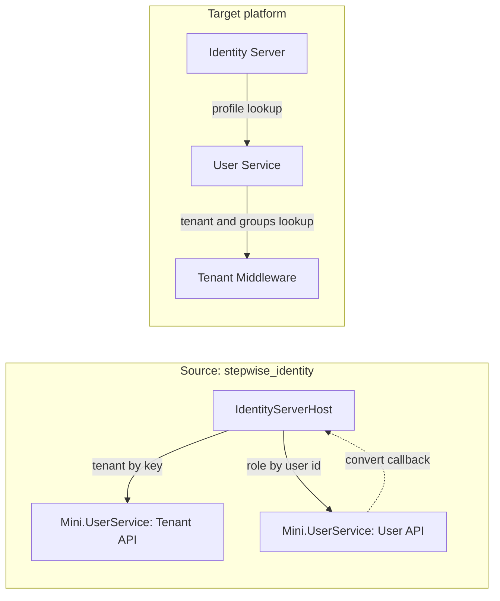

# Mini.UserService: what goes to the User Service, the Tenant Middleware, or nowhere

**Task**: T016 | **Source**: `C:\MyWork\stepwise_identity\src\Mini.UserService` (read directly, 2026-10-06)

In the source, one project plays two roles. Its README says it stands in for two sibling production
services: a Tenant Management API and a User API. The new platform separates them: Track U (User
Service) and Track M (Tenant Middleware). This document proposes where each piece goes. It is a
proposal for the owner to review (task T018).

## What the source contains

| Area | Where in the source | What it does |
|------|---------------------|--------------|
| Tenant read API | `Endpoints/TenantEndpoints.cs` | `GET /api/v1/tenants/GetByKey/{tenantKey}` (policy `TenantApi`) |
| Tenant management | `Endpoints/ManagementEndpoints.cs` | `POST /api/v1/management/tenants`, `DELETE /api/v1/management/tenants/{tenantKey}` (policy `TenantApiManagement`, service-account only) |
| User role read | `Endpoints/UserEndpoints.cs` | `GET /api/v2/User/identities/role/{userId}` (policy `UserApi`) |
| User lookup by email | `Endpoints/UserEndpoints.cs` | `GET /api/v2/User/identities/email` |
| Id conversion | `Endpoints/UserEndpoints.cs`, `ExternalServices/IdentityGatewayClient.cs` | `GET /api/v2/useridentity/convert/{userId}`; calls back into the Identity Server's `UserConversionController` with a client-credentials token |
| Role management | `Endpoints/ManagementEndpoints.cs` | `PUT` and `DELETE /api/v2/management/user/identities/role/{userId}` (policy `UserApiManagement`, service-account only) |
| Data | `Data/ServiceDbContext.cs` | Two tables: `Tenants` (`TenantId` key, `Key` unique, seeded) and `UserIdentityRoles` (`UserId` key, `Role`, one role per user, seeded) |
| Connectors | `Connectors/` (`ClaimConnector`, `WebApiConnector`, handlers, repositories), `Connectors/Data/CascadingConnectorDbContext.cs` | Per-tenant, cascading user sources; a second EF context on the same database |

## Proposed split

| Piece | Decision | Goes to | Reason |
|-------|----------|---------|--------|
| `Tenants` table, `GetByKey`, tenant management | **Move, redesigned** | Track M (Tenant Middleware) | Target says tenant and groups come from the Tenant Middleware, with deterministic stub data behind an interface. The source's seeded tenants become the first stub set. Management endpoints are not needed while data is stub |
| `UserIdentityRoles` table, role read | **Keep, redesigned** | Track U | Roles stay owned by the User Service. The model grows from one role string per user to User, ExternalIdentity, Role and UserRole (`specs/001-identity-platform-build/data-model.md` in `anchorpoint.identity.gateway` is the working draft) |
| Role management (`PUT`/`DELETE`) | **Later** | Track U | Not needed for sign-in. Users and roles come from seed data in v1 |
| Seeding through `HasData` | **Adapt** | Track U | Keep the idea (rows arrive with the schema, deterministic values) but use stable UUIDs, not integer ids, to avoid sequence drift on PostgreSQL (see postgres-migration-notes) |
| Lookup by email (`/User/identities/email`) | **Never in v1** | none | Decision: users are matched by (provider, provider user ID), never by email |
| Id conversion and `IdentityGatewayClient` | **Never** | none | It is the source of the circular dependency (Identity Server calls User Service, which calls back). Legacy consumers need it; the new platform has none. Recorded to avoid reintroducing the loop |
| Connectors and the second EF context | **Later / never** | none this phase | Per-tenant, cascading user sources are an advanced feature. The User Service owns roles in a local table for v1 |
| `Mini.AcmeApi` (the tenant-owned system a connector calls) | **Never this phase** | none | Exists only to exercise connectors |
| Management auth: `ServiceAccountOnlyFilter` and policies | **Adapt** | Track C (`Auth` component), used by U and M | Scope-based policies (`user.read`, `tenant.read`) replace the three named policies and the "no `sub` claim means service" heuristic |

## New pieces that have no source counterpart

| Piece | Track | Why it is new |
|-------|-------|---------------|
| `POST /api/v1/profiles/lookup` returning one merged profile (identity, roles, groups, tenant) | U | In the source the Identity Server calls a Tenant API and a User API separately. The target gives it one call to the User Service |
| User Service to Tenant Middleware call | U | In the source there is no such hop: both APIs live in one project and the Identity Server calls both |
| Groups | M | The source and the production repos have no group concept |
| `POST /api/v1/identities/lookup` returning tenant and groups for an external identity | M | New contract (see [contracts.md](contracts.md)) |
| Unknown-user refusal, inactive-user refusal, fail-closed 503 | U | New behavior from the clarified decisions |

## Data flow before and after

## Points for the owner to confirm

1. Tenant ownership moves from the User Service to the Tenant Middleware, with stub data first.
2. The role model grows from one role per user to a many-to-many User and Role model.
3. The id-conversion endpoint and its callback are dropped, which removes the circular dependency.
4. Connectors are deferred; the User Service owns roles in a local table.
