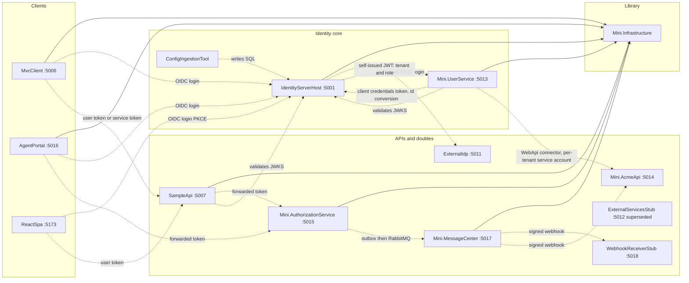
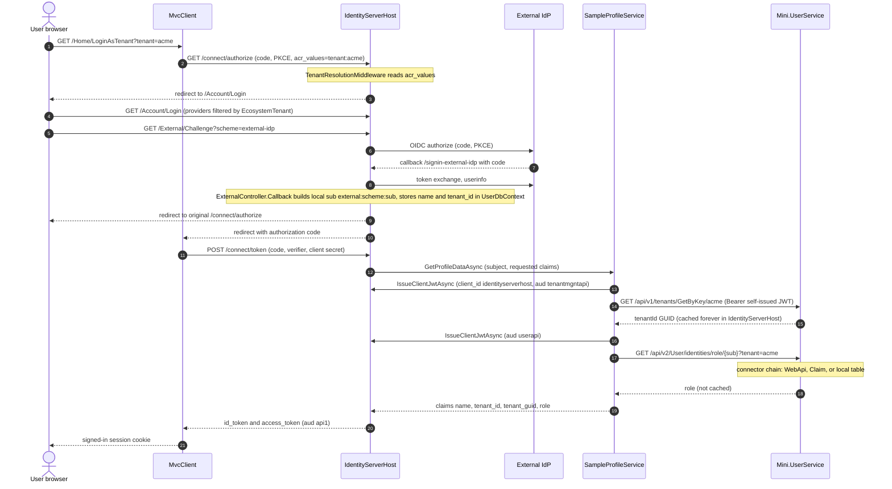
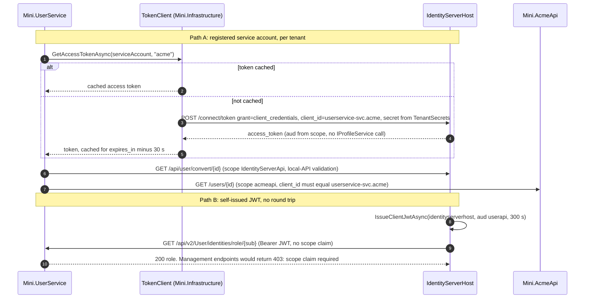

# Source analysis: the stepwise_identity reference solution

> Written for a new engineer joining the DIT identity platform program. Read this before opening the
> reference code.

## 1. Source of truth statement

`C:\MyWork\stepwise_identity` is the **primary source of truth** for this program, as of **2026-10-06**.
It is a 24-phase teaching solution ("Mini Identity Gateway") whose last commit is `chore: phase 24`
(`git log`). Runtime is net10.0 (`src/*/*.csproj`), Duende.IdentityServer 8.0.6
(`src/IdentityServerHost/IdentityServerHost.csproj`), EF Core 10.0.7 on SQL Server.

All paths below are relative to `C:\MyWork\stepwise_identity` and written as plain backticked paths (they
live outside this docs repo, so they are deliberately not links).

Two caveats that apply to everything here:

- It is a **teaching** solution. Its own comments repeatedly say "deliberate simplification". Treat it as
  a behavioural reference, not as production code to copy.
- Where this document says "unverified" it means I read the code but could not confirm runtime behaviour
  (nothing was executed). See section 6.

## 2. Inventory of projects

Phase numbers come from `README.md` (phase list and per-project bullets) and from the phase headings in
`src/IdentityServerHost/README.md`. "Track" is the mapping to the new program: C = shared library
(`anchorpoint.lib.infrastructure`), U = User Service, I = Identity Server, M = Tenant Middleware,
W = Demo Web App.

| Project | Purpose | Key files | Framework / packages | Database | Phase | Maps to |
| --- | --- | --- | --- | --- | --- | --- |
| IdentityServerHost (:5001) | The authorization server. Federates to external IdPs, issues tokens, calls the user service for claims. | `src/IdentityServerHost/Program.cs`, `Services/SampleProfileService.cs`, `ExternalServices/UserClient.cs`, `ExternalServices/TenantClient.cs`, `Controllers/ExternalController.cs`, `Controllers/UserConversionController.cs`, `KeyManagement/*`, `Configurations/Authentication/*`, `Configurations/IdentityServerConfig.json` | Duende.IdentityServer + .EntityFramework 8.0.6, EF Core SqlServer 10.0.7, Azure.Identity 1.21.0, Azure.Security.KeyVault.Certificates 4.9.0, Microsoft.Extensions.Http.Polly 10.0.11 (`IdentityServerHost.csproj`) | SQL Server LocalDB `MiniIdG` (`appsettings.Development.json`): three contexts, `ConfigurationDbContext`, `PersistedGrantDbContext` (Duende) and `UserDbContext` (app) | 1 (foundation), 3, 4, 5, 7, 8, 9, 11 | **I** |
| Mini.UserService (:5013) | Stands in for two sibling DIT services: Tenant Management API and User API. Owns tenants, roles, and the per-tenant "connector" machinery that decides where a role comes from. Calls back into IdentityServerHost. | `src/Mini.UserService/Program.cs`, `Endpoints/{User,Tenant,Management}Endpoints.cs`, `Data/ServiceDbContext.cs`, `ExternalServices/IdentityGatewayClient.cs`, `Connectors/**` | JwtBearer 10.0.7, EF Core SqlServer 10.0.7, project ref Mini.Infrastructure | LocalDB `MiniUsers` (`appsettings.Development.json`), two contexts on one database: `ServiceDbContext` (Tenants, UserIdentityRoles) and `CascadingConnectorDbContext` (history table `__EFMigrationsHistory_Connectors`, `Connectors/ConnectorsExtensions.cs`) | 11, 12 | **U** (and the Tenant API half is **M**-shaped, see section 5) |
| Mini.Infrastructure | Shared class library: identity context, tenant context, service-account token client, Polly policies, authorization client, MassTransit bus wrapper. | `src/Mini.Infrastructure/Identity/*`, `ExternalServices/*`, `Http/ResiliencePolicies.cs`, `MultiTenant/*`, `Messaging/*` | `FrameworkReference Microsoft.AspNetCore.App`, IdentityModel 7.0.0, Http.Polly 10.0.11, MassTransit + MassTransit.RabbitMQ 8.3.4 (`Mini.Infrastructure.csproj`) | None (no EF at all) | 10 (extracted), 16, 18, 19 | **C** |
| MvcClient (:5006) | Server-side confidential OIDC client, stands in for "Apply". Logs in per tenant, calls SampleApi with a user token and with a service-account token. | `src/MvcClient/Program.cs`, `Controllers/HomeController.cs`, `Infrastructure/Configuration/IdentityGatewayConfiguration.cs` | Microsoft.AspNetCore.Authentication.OpenIdConnect 10.0.7, IdentityModel 7.0.0, Http.Polly | None | 2, 3, 7 | **W** (closest analogue) |
| AgentPortal (:5016) | Second confidential MVC client; checks authorization and edits per-tenant policy via Mini.AuthorizationService. | `src/AgentPortal/Program.cs`, `Controllers/{Home,Policy}Controller.cs`, `Services/PolicyAdminClient.cs`, `Data/AgentPortalDbContext.cs` | OpenIdConnect 10.0.7, EF Core SqlServer 10.0.7 | LocalDB `AgentPortalDb` (`appsettings.Development.json`) | 17, 18, 22 | **W** (second client example); its authorization features are out of scope |
| ReactSpa (:5173) | Public browser SPA (PKCE only, no secret). | `src/ReactSpa/src/main.tsx`, `src/App.tsx`, `package.json` | React 19.2, oidc-client-ts 3.5, react-oidc-context 3.3, Vite 8, TypeScript 6 (`package.json`) | None | 2 | **W** (alternative public-client pattern) |
| SampleApi (:5007) | JWT-protected API that MvcClient and ReactSpa call; forwards to the authorization service. | `src/SampleApi/Program.cs` | JwtBearer 10.0.7, Asp.Versioning.Http 8.1.0, project ref Mini.Infrastructure | None | 2, 14, 16 | Out of scope as a product; its `JwtBearer` + `IIdentityContext` setup is the pattern for any protected API (**U** uses the same one) |
| ExternalIdp (:5011) | A second, independent Duende server that plays a partner/customer IdP. In-memory config, one test user `carol`. | `src/ExternalIdp/Program.cs`, `Config.cs`, `TestUsers.cs` | Duende.IdentityServer 8.0.6 | None (in-memory) | 4, 9 | Test double for the **I** track (stands in for Entra ID) |
| Mini.AuthorizationService (:5015) | Per-tenant authorization decisions, 30 s decision cache, policy admin API, transactional outbox publishing `PolicyChangedEvent`. | `src/Mini.AuthorizationService/Program.cs`, `Data/AuthorizationDbContext.cs`, `DecisionCache.cs`, `PolicyAdminTenantGate.cs`, `Outbox/OutboxDispatcher.cs` | JwtBearer, EF Core SqlServer, MassTransit + RabbitMQ 8.3.4 | LocalDB `MiniAuthorization` (`appsettings.Development.json`) | 13, 14, 15, 21, 23, 24 | Out of scope this phase |
| Mini.MessageCenter (:5017) | Consumes `PolicyChangedEvent` from RabbitMQ and fans out HMAC-signed webhooks with Polly retry and de-dup. | `src/Mini.MessageCenter/Program.cs`, `Messaging/PolicyChangedEventConsumer.cs`, `Webhooks/WebhookDeliveryService.cs`, `Data/MessageCenterDbContext.cs` | EF Core SqlServer, Http.Polly, MassTransit + RabbitMQ | LocalDB `MiniMessageCenter` | 20, 24 | Out of scope |
| WebhookReceiverStub (:5018) | Test aid: verifies HMAC and stores received webhooks in memory. | `src/WebhookReceiverStub/Program.cs` | none beyond ASP.NET Core | None | 20 | Out of scope |
| Mini.AcmeApi (:5014) | Stand-in for a system a **tenant** owns (Acme's own user API); a WebApi connector target. | `src/Mini.AcmeApi/Program.cs`, `appsettings.json` | JwtBearer 10.0.7 | None (in-memory dictionary) | 12 | Out of scope (test double for the connector feature) |
| ExternalServicesStub (:5012) | Hard-coded tenant and role dictionary. **Superseded** by Mini.UserService, kept for comparison. | `src/ExternalServicesStub/Program.cs` | JwtBearer 10.0.7 | None | 7 (superseded 11) | Out of scope |
| ConfigIngestionTool | Console tool: reads `IdentityServerConfig.json` and writes clients, scopes, resources and identity providers into the IdentityServer database. | `src/Tools/ConfigIngestionTool/Program.cs`, `ConfigDocument.cs`, `appsettings.json` | Duende.IdentityServer.EntityFramework 8.0.6, EF Core SqlServer 10.0.7 | Writes to `MiniIdG` | 6 | **I** (deployment-time config seeding) |
| StepwiseIdentity.Tests | The single xunit project: decision tables only. | `tests/StepwiseIdentity.Tests/*.cs` | xunit 2.9.3, EF InMemory 10.0.7, MassTransit.TestFramework 8.3.4 (`StepwiseIdentity.Tests.csproj`) | EF InMemory | 11+ | Pattern for **C/U/I** unit tests |

Supporting assets: `run-all.ps1` (starts everything, runs ingestion first), `docker-compose.yml` (RabbitMQ only),
`test-phase*.ps1` (end-to-end scripts per phase), `CONTEXT.md` (glossary), `docs/architecture/*`,
`docs/adr/0001-messaging-transport.md`, `docs/reference/*` (vendor-neutral OAuth/OIDC primer).

## 3. How the projects fit together

### 3.1 Project references

Only **one** library exists: `Mini.Infrastructure`. Every other project references it, except the three
test doubles and the IdP.

| Project | Project references |
| --- | --- |
| IdentityServerHost | Mini.Infrastructure (used only for `ResiliencePolicies`, see `Program.cs`) |
| Mini.UserService | Mini.Infrastructure |
| MvcClient, AgentPortal, SampleApi, Mini.AuthorizationService, Mini.MessageCenter | Mini.Infrastructure |
| ExternalIdp, ExternalServicesStub, Mini.AcmeApi, WebhookReceiverStub, ConfigIngestionTool | none |
| StepwiseIdentity.Tests | IdentityServerHost, Mini.Infrastructure, Mini.UserService, Mini.AuthorizationService, Mini.MessageCenter |

Note the two Duende-dependent apps do not share any Duende abstraction with each other; services find
each other only by HTTP and by the config `ExternalServicesApi`.

### 3.2 Shared abstractions in Mini.Infrastructure

| Abstraction | File | What it does |
| --- | --- | --- |
| `IIdentityContext` / `IdentityContext` / `IdentityContextMiddleware` | `src/Mini.Infrastructure/Identity/*.cs` | Populated from `ClaimsPrincipal`. `sub` present means `User`, absent means `Service`. Tenant for a user is the `tenant_id` claim; for a service it is the suffix of `client_id` (`userservice-svc.acme` gives `acme`). |
| `ServiceAccountOnlyFilter` | `Identity/ServiceAccountOnlyFilter.cs` | Endpoint filter: 401 if unauthenticated, 403 if `IdentityType` is not `Service`. |
| `ITokenClient` / `TokenClient` | `ExternalServices/TokenClient.cs` | `client_credentials` via `IdentityModel`; client id is `{ServiceAccount.ClientId}.{tenantKey}`; secret looked up in `ServiceAccount.TenantSecrets`; token cached in `IMemoryCache` for `expires_in - 30 s` (minimum 30 s). |
| `ExternalServicesConfiguration`, `ServiceDefinition`, `ServiceAccount` | `ExternalServices/*.cs` | Option classes for the `ExternalServicesApi` section; `GetServiceDefinition(name)` inherits `BaseUri` and `ServiceAccount` from the parent. |
| `ResiliencePolicies.Retry()` / `CircuitBreaker()` | `Http/ResiliencePolicies.cs` | Polly: 2 retries with 2 s and 4 s waits; breaker opens after 3 failures for 30 s. |
| `IAuthorizationClient` / `AuthorizationClient` | `ExternalServices/AuthorizationClient.cs` | Fails closed: any error returns `Authorized = false`. |
| `ITenantContext`, `TenantContext`, `Tenant`, `Tenants`, `RequireTenantAttribute`, `TenantResolutionMiddleware` | `MultiTenant/*.cs` | Claims-based tenant for already-authenticated users. `Tenants.All` is a hard-coded dictionary with `acme` and `globex` only. |
| `AddMessageBus`, `MessageQueueOptions`, `PolicyChangedEvent` | `Messaging/*.cs` | MassTransit wrapper; providers InMemory, RabbitMQ; AzureServiceBus throws `NotSupportedException`. |

### 3.3 DI extension methods

| Extension | File | Registers |
| --- | --- | --- |
| `AddSigningKey(IConfiguration)` | `src/IdentityServerHost/KeyManagement/SigningKeyExtensions.cs` | `AddDeveloperSigningCredential()` unless `KeyManagement:Provider` is `AzureKeyVault`; then `AzureKeyVaultKeyStore` as singleton for both `ISigningCredentialStore` and `IValidationKeysStore`. |
| `AddExternalProvidersFromFile(IConfiguration)` | `src/IdentityServerHost/Configurations/Authentication/ExternalProviderAuthenticationExtensions.cs` | One `AddOpenIdConnect` per entry in `ExternalProviders:OpenId`. |
| `AddOpenId`, `ConfigureOpenId` | `Configurations/Authentication/OpenId/OpenIdConnectAuthenticationExtensions.cs` | Shared OIDC options (code + PKCE, scopes `openid profile` + configured, `MapInboundClaims = false`, `SignInScheme = idsrv.external`). |
| `AddDynamicIdentityProviders()` | `Configurations/Extensions/DynamicIdentityProviderExtensions.cs` | DB-backed `openidconnect` provider type; only called when `DynamicIdentityProviderEnabled` is true. |
| `AddConnectors(IConfiguration)` | `src/Mini.UserService/Connectors/ConnectorsExtensions.cs` | Connector DbContext, repositories, `IWebApiConnector`, `IClaimConnector`, handlers. |
| `AddMessageBus(IConfiguration, Action<IBusRegistrationConfigurator>?)` | `src/Mini.Infrastructure/Messaging/MessageBusExtensions.cs` | MassTransit with the configured transport. |
| `MapTenantEndpoints`, `MapUserEndpoints`, `MapManagementEndpoints` | `src/Mini.UserService/Endpoints/*.cs` | Minimal API route groups. |

### 3.4 Configuration binding

| Section | Bound to | Used by | Evidence |
| --- | --- | --- | --- |
| `ConnectionStrings:IdentityServer` | read directly with `GetConnectionString` | IdentityServerHost, ConfigIngestionTool (`appsettings.json` repeats the same string) | `IdentityServerHost/Program.cs`, `Tools/ConfigIngestionTool/Program.cs` |
| `ConnectionStrings:ServiceDb` | direct | Mini.UserService (both contexts) | `Mini.UserService/Program.cs`, `ConnectorsExtensions.cs` |
| `ExternalProviders` | `ExternalProvidersOptions` (list of `OpenIdConnectProviderOptions`) | IdentityServerHost | `Configurations/Authentication/ExternalProvidersOptions.cs` |
| `ExternalServicesApi` | **two different classes under one name**: `ExternalServicesOptions` (Tenant/User, self-issued JWT) in IdentityServerHost; `ExternalServicesConfiguration` (ServiceAccount + ServiceDefinitions) in everything else | see left | `IdentityServerHost/ExternalServices/ExternalServicesOptions.cs`, `Mini.Infrastructure/ExternalServices/ExternalServicesConfiguration.cs` |
| `KeyManagement` (and `KeyManagement:AzureKeyVault`) | `KeyManagementOptions`, `AzureKeyVaultOptions` | IdentityServerHost | `KeyManagement/KeyManagementOptions.cs` |
| `DynamicIdentityProviderEnabled` | bool via `GetValue` | IdentityServerHost | `Program.cs`, `AuthenticationHelper.cs` |
| `IdentityGatewayApi` | `IdentityGatewayConfiguration` | MvcClient only | `MvcClient/Infrastructure/Configuration/IdentityGatewayConfiguration.cs` |
| `Authentication:Authority`, `Authentication:Audience(s)` | read directly | Mini.UserService, Mini.AcmeApi, Mini.AuthorizationService (SampleApi and ExternalServicesStub hard-code `https://localhost:5001` in code) | respective `Program.cs` |
| `MessageBus` | `MessageQueueOptions` | AuthorizationService, MessageCenter | `Messaging/MessageQueueOptions.cs` |

### 3.5 Middleware pipelines (order in `Program.cs`)

| Project | Order |
| --- | --- |
| IdentityServerHost | `UseStaticFiles`, `UseRouting`, **`TenantResolutionMiddleware`** (local class, reads `acr_values`), `UseIdentityServer` (includes `UseAuthentication`), `UseAuthorization`, `MapDefaultControllerRoute`, `/health` |
| Mini.UserService | `UseExceptionHandler`, `UseAuthentication`, `IdentityContextMiddleware`, `UseAuthorization`, endpoint groups, `/health` |
| SampleApi | `UseExceptionHandler`, `UseCors("ReactSpa")`, `UseAuthentication`, `IdentityContextMiddleware`, `UseAuthorization` |
| MvcClient | `UseStaticFiles`, `UseRouting`, `UseAuthentication`, `Mini.Infrastructure TenantResolutionMiddleware`, `UseAuthorization` |
| AgentPortal | as MvcClient plus `IdentityContextMiddleware` after tenant middleware |
| Mini.AuthorizationService | `UseAuthentication`, `UseAuthorization` (identity built from `IHttpContextAccessor` in a scoped factory instead of the middleware) |

All services expose an anonymous `GET /health` returning `{ status: "healthy" }`.

### 3.6 Authentication and authorization setup

| Service | Authentication | Authorization |
| --- | --- | --- |
| IdentityServerHost | Duende itself, cookies (all forced to SameSite Lax, `SecurePolicy.SameAsRequest`), plus `AddLocalApiAuthentication()` for `/api/user/convert` | Policy `IdentityServerConstants.LocalApi.PolicyName` requiring scope `IdentityServerApi` (`Controllers/UserConversionController.cs`) |
| Mini.UserService | JwtBearer, `Authority` from config, `ValidAudiences = [tenantmgntapi, userapi]`, `MapInboundClaims = false` | Policies `TenantApi`/`UserApi` require `aud`; `TenantApiManagement`/`UserApiManagement` additionally require a `scope` claim (this is what keeps the IdP's self-issued read token from writing); management endpoints also use `ServiceAccountOnlyFilter` (`Program.cs`, `Endpoints/ManagementEndpoints.cs`) |
| MvcClient, AgentPortal | cookies + OIDC, code + PKCE, `client_secret`, scopes `openid profile api1 tenant`, `MapInboundClaims = false`, `SaveTokens = true`, `GetClaimsFromUserInfoEndpoint = true` | `[Authorize]` + `[RequireTenant]` |
| SampleApi | JwtBearer, audience `api1` | Policy `ApiScope` requires `scope = api1` |
| Mini.AuthorizationService | JwtBearer, audiences `authapi` and `api1` | Its own policy table; admin PUT has a tenant gate (`PolicyAdminTenantGate`) |

### 3.7 The bidirectional dependency: IdentityServerHost and Mini.UserService

This is the single most important structural fact for Track I and Track U.

**Direction 1, IdentityServerHost to Mini.UserService (hot path, every interactive login).**
`SampleProfileService.GetProfileDataAsync` (`src/IdentityServerHost/Services/SampleProfileService.cs`):

1. Loads the subject's stored claims: `TestUserStore` for local users, `ExternalUserStore` for federated ones.
2. If a `tenant_id` claim exists, adds `tenant_guid` by calling `TenantClient` (`GET {Address}/v1/tenants/GetByKey/{key}`), cached in `IDistributedCache` with `AbsoluteExpiration = DateTimeOffset.MaxValue`.
3. Adds `role` by calling `UserClient.GetRoleAsync(subjectId, tenantKey)` (`GET {Address}/v2/User/identities/role/{subjectId}?tenant={tenantKey}`), deliberately **not** cached.
4. Calls `context.AddRequestedClaims(...)`, so only claims requested through the scopes' `UserClaims` are emitted.

Both calls authenticate with a **self-issued JWT**: `IIdentityServerTools.IssueClientJwtAsync(clientId: "identityserverhost", lifetime: 300, audiences: [...])`
(`ExternalServices/UserClient.cs`, `TenantClient.cs`). No `/connect/token` round trip, no registered client, no secret.
Claims on that token: `iss, nbf, iat, exp, client_id, aud` and nothing else (`docs/architecture/service-to-service-auth.md`).

**Direction 2, Mini.UserService back to IdentityServerHost (cold path).**
`GET /api/v2/useridentity/convert/{userId}` in `Mini.UserService/Endpoints/UserEndpoints.cs` calls
`IdentityGatewayClient`, which obtains a real `client_credentials` token as `userservice-svc.{tenant}` (via
`ITokenClient`) and calls `GET /api/user/convert/{userId}?convertTo=Local|External` on IdentityServerHost
(`Controllers/UserConversionController.cs`, protected by Duende local-API auth and scope `IdentityServerApi`).
The mapping lives in IdentityServerHost's `UserDbContext` only, which is why the call has to go back.

**Why it does not deadlock today.** Mini.UserService needs a token from IdentityServerHost. That is a
`client_credentials` grant with no subject, so Duende does not call `IProfileService` for it, so
`SampleProfileService` (which would call Mini.UserService) is not invoked. The repo's own doc states this is
a property of the current design, not a guarantee (`docs/architecture/service-to-service-auth.md`, "The cycle is real, and does not deadlock").

**Three credential types, not interchangeable:**

| | Self-issued JWT | Service-account token | Duende local API |
| --- | --- | --- | --- |
| Used by | IdentityServerHost to Mini.UserService reads | MvcClient to SampleApi; Mini.UserService to IdentityServerHost and to Mini.AcmeApi; operators to management API | IdentityServerHost protecting its own API |
| Registered client | No | Yes, per tenant | n/a |
| Revocable without redeploy | No (only by rotating the signing key) | Yes | n/a |

### 3.8 Tenant resolution (four places, three meanings)

| Where | Source | When | Evidence |
| --- | --- | --- | --- |
| IdentityServerHost `TenantContext` + `TenantResolutionMiddleware` | `acr_values=tenant:<key>` on the query string (or nested in `ReturnUrl`), validated against the hard-coded `Tenants.DisplayNames` (acme, globex, initech) | Before authentication; "no tenant" is normal | `src/IdentityServerHost/Tenants.cs`, `TenantResolutionMiddleware.cs` |
| `Mini.Infrastructure` `ITenantContext` | `tenant_id` claim, looked up in `Tenants.All` (acme, globex only) | After authentication; "no tenant" gives 401 via `[RequireTenant]` | `Mini.Infrastructure/MultiTenant/*` |
| `IIdentityContext.TenantKey` | `tenant_id` claim for users, `client_id` suffix for service accounts | Per request, APIs | `Mini.Infrastructure/Identity/IdentityContext.cs` |
| Mini.UserService `Tenants` table | DB rows (acme, globex, initech seeded with fixed GUIDs) | Lookup by key; used by the connector chain | `Mini.UserService/Data/ServiceDbContext.cs` |

How the tenant gets to IdentityServerHost: MvcClient's `OnRedirectToIdentityProvider` sets `AcrValues = "tenant:{key}"` (`MvcClient/Program.cs`).
After login the user's `tenant_id` claim is carried through the external login in `AuthenticationProperties.Items["tenant"]`
(`Controllers/ExternalController.cs`) and persisted by `ExternalUserStore`.

### 3.9 Signing key management

`KeyManagement:Provider` selects the key source (`appsettings.json` sets `Developer`).

- `Developer`: Duende `AddDeveloperSigningCredential()` writing `tempkey.jwk` into the project folder.
- `AzureKeyVault`: `AzureKeyVaultKeyStore` (`KeyManagement/AzureKeyVaultKeyStore.cs`) lists all enabled, non-expired versions of one certificate, makes **all** of them validation keys, and picks as signer the newest version older than `RolloverDelayHours` (default 48). The result is cached for `RefreshIntervalHours` (default 24). Credentials: `DefaultAzureCredential` unless `ClientId`/`ClientSecret` are set.
- Duende's own automatic key management is switched off: `options.KeyManagement.Enabled = false` (`Program.cs`).

### 3.10 External identity provider federation

| Item | Detail | Evidence |
| --- | --- | --- |
| Two flavours | File-configured schemes under `ExternalProviders:OpenId` (callback `/signin-external-idp`, `/signin-oidc-entra`), and DB-backed dynamic providers (callback `/federation/{scheme}/signin`) | `appsettings.Development.json`, `OpenIdConnectConfigureOptions.cs` |
| Per-tenant offer | Each provider declares `EcosystemTenant`; `AuthenticationHelper.GetAllAvailableIdentityProvidersAsync(tenantKey)` filters the login page. Config wins over DB on a scheme-name clash. | `Configurations/Authentication/Helpers/AuthenticationHelper.cs` |
| Entra ID is already wired | Provider `entra-acme` with a real-looking authority `login.microsoftonline.com/{tenant-guid}/v2.0`, scope `email` | `appsettings.Development.json` |
| OIDC settings | code + PKCE, query response mode, `MapInboundClaims = false`, `RequireHttpsMetadata = false`, `PushedAuthorizationBehavior.Disable` | `OpenIdConnectAuthenticationExtensions.cs` |
| Callback | `ExternalController.Callback` reads `sub` and `name` from the external principal, builds local subject `external:{scheme}:{externalSubjectId}`, stores `name` and `tenant_id` in `UserDbContext`, signs in with `IdentityServerUser` | `Controllers/ExternalController.cs` |
| Claims discarded | Everything other than `sub` and `name` (email, groups, etc.) is dropped | same file |

### 3.11 EF contexts and stores

| Context | Project | Tables (key ones) | Notes |
| --- | --- | --- | --- |
| `ConfigurationDbContext` | IdentityServerHost (Duende stock) | Clients, scopes, resources, IdentityProviders | Filled by ConfigIngestionTool, not the app |
| `PersistedGrantDbContext` | IdentityServerHost (Duende stock) | grants, codes, refresh tokens, consent | |
| `UserDbContext` | IdentityServerHost | `Users` (key `SubjectId`), `UserClaims` | Composite string subject key |
| `IdentityProviderStore` | IdentityServerHost | subclass of Duende's EF store mapping `Type` to `OpenIdConnectProvider` | `IdentityServer/EntityFramework/Stores/IdentityProviderStore.cs` |
| `ServiceDbContext` | Mini.UserService | `Tenants`, `UserIdentityRoles` | Seeds acme/globex/initech and role `Admin` for user `1` via `HasData` |
| `CascadingConnectorDbContext` | Mini.UserService | Connectors, Handlers, ConnectorHandlers, ConnectorHandlerTenants, ConnectorHandlerCascadingTenants, WebApiConnectorConfiguration(+Routes), ClaimConnectorConfigurations | Same database as `ServiceDbContext`, separate migrations history table |
| `AuthorizationDbContext` | Mini.AuthorizationService | Policies, CachedDecisions, OutboxMessages | |
| `MessageCenterDbContext` | Mini.MessageCenter | WebhookSubscriptions, DeliveryAttempts, ProcessedEvents | |
| `AgentPortalDbContext` | AgentPortal | PolicyChangeRequests | |

All apps call `Database.Migrate()` at startup. IdentityServerHost, Mini.UserService, Mini.AuthorizationService, Mini.MessageCenter and AgentPortal all do (`SeedData.EnsureDatabasesMigrated`, `Program.cs`).

### 3.12 Connector chain in Mini.UserService (how `role` is decided)

`GET /api/v2/User/identities/role/{userId}?tenant=` (`Endpoints/UserEndpoints.cs`):

| Tenant state | Result |
| --- | --- |
| no `tenant` query value | role from `UserIdentityRoles`, default `Member` |
| unknown or inactive tenant | 404 |
| tenant with connectors | `GetUserRoleHandler` runs the chain (`ActionHandlerBase.ExecuteAsync`): cascading rows ordered by `Order`, else the single enabled connector. Connector types: `WebApi` (calls the tenant's host with a service-account token), `Claim` (reads a claim off the caller's own token), `AzureGraph` (catalog row only, returns "not implemented"). |
| chain answered | that value |
| chain gave no value | `Member` |
| no connector configured | local table role |
| single non-cascading connector failed | 502 |

A cascading chain silently absorbs a failed connector and moves on, which can quietly downgrade a role
(`docs/architecture/connectors.md`, finding stated in `README.md`).

## 4. Diagrams

### 4.1 Project dependency graph

Solid arrows are project references (build time). Dashed arrows are runtime HTTP calls.

### 4.2 Sign-in and token issuance, including the call to Mini.UserService

### 4.3 Service-to-service token acquisition

## 5. Things that surprised me / risks for the rebuild

| # | Observation | Evidence | Why it matters |
| --- | --- | --- | --- |
| 1 | **Committed key material.** `src/IdentityServerHost/tempkey.jwk` is tracked by git (`git ls-files` lists it, first added in `chore: idg phase 01`) even though `.gitignore` has a `tempkey.jwk` rule. The file is an RS256 JWK that contains the private members (`d`, `p`, `q`, `dp`, `dq`, `qi`). The same file name in `src/ExternalIdp` is not tracked. | `git ls-files`, `.gitignore`, file field names inspected without printing values | A rule added after the file was committed does not untrack it. In the rebuild, never use the developer signing credential in a shared repo; treat any key in that history as compromised if it was ever used outside a laptop. |
| 2 | **Plaintext secrets in config and code.** `IdentityServerConfig.json` carries client secrets (`secret`, `agentportal-secret`, `acme-svc-secret`, `userservice-mgmt-secret`, `external-secret-initech`, and more); MvcClient and AgentPortal hard-code `ClientSecret` in `Program.cs`; `Mini.UserService/appsettings.Development.json` holds per-tenant service secrets; MessageCenter seeds subscription secrets. Entra `ClientId` and tenant GUID are committed in `IdentityServerHost/appsettings.Development.json`. The repo says this is deliberate. | files named | Rebuild needs a secrets story from day one (Key Vault or equivalent), and `ConfigIngestionTool`-style seeding must not read secrets from a committed JSON. |
| 3 | **The IdP to User Service dependency is bidirectional**, and the absence of a deadlock rests on Duende not invoking `IProfileService` for `client_credentials` grants. | `docs/architecture/service-to-service-auth.md`; `SampleProfileService.cs` | For the new tracks this is a design constraint: the Track U service must never require a user-flow token from Track I to answer Track I's profile call. Needs an explicit contract test. |
| 4 | **The target flow differs from the reference in who calls whom.** Target: User Service calls Tenant Middleware and merges roles. Reference: IdentityServerHost calls *both* Tenant Management and User APIs itself (`TenantClient` and `UserClient`), and both are served by the same process, Mini.UserService, which owns the `Tenants` table. | `SampleProfileService.cs`, `Mini.UserService/Endpoints/TenantEndpoints.cs`, `ServiceDbContext.cs` | The reference has no analogue of "User Service calls Tenant Middleware". That hop and the merge are new design work. |
| 5 | **No `group` claim, no `email` for federated users, no `sub` as provider sub.** A search of `src` finds no groups handling at all. The `api1` resource lists `email`, but `ExternalController` persists only `name` and `tenant_id` for federated users, so email is never issued for them. The issued `sub` is the local string `external:{scheme}:{externalSub}`, not the provider's `sub`. | `Controllers/ExternalController.cs`, `IdentityServerConfig.json`, grep for "group" | Target claims `sub,name,email,role,group,tenant` need new work: group and email mapping, and a decision on the `sub` format. |
| 6 | **Tenant claim is called `tenant_id`, but also carries a *key*** (`acme`), and a second claim `tenant_guid` carries the GUID. The reference documents that real IdG's `tenant_id` is the GUID. | `SampleProfileService.cs` comment | Naming collision. The rebuild should decide once whether `tenant` is a key or an id and keep a single claim. |
| 7 | **Dual TenantContexts and three tenant registries that agree only by convention.** `IdentityServerHost/TenantContext.cs` (intent from `acr_values`, pre-auth) vs `Mini.Infrastructure/MultiTenant/TenantContext.cs` (fact from claims, post-auth). Registries: `IdentityServerHost/Tenants.cs` (acme, globex, initech), `Mini.Infrastructure/MultiTenant/Tenants.cs` (acme, globex only), `Mini.UserService` `Tenants` table (three seeded). `initech` therefore resolves at the IdP but gets 401 in MvcClient. | `src/Mini.Infrastructure/README.md` ("The two TenantContexts stay separate", "drift is already real") | Do not put a hard-coded tenant dictionary in the Track C library. Tenant source must be pluggable (and in the rebuild, Track M). |
| 8 | **`IdentityType` is inferred from the absence of `sub`.** Three caller kinds, two enum values: the IdP's own self-issued JWT looks the same as a registered service account. Mini.UserService patched it with a `scope` requirement on management policies only. | `IdentityContext.cs`, `service-to-service-auth.md` | Track C should model caller kind explicitly (the repo itself says a real system reads an explicit claim). |
| 9 | **Self-issued JWT cannot be revoked without rotating the signing key**, and its audience is the only gate on reads. | `service-to-service-auth.md` | Rebuild target says client credentials with scope `user.read`; that is the *other* mechanism (registered client). Good, but it differs from the reference's read path, which uses the self-issued JWT. |
| 10 | **Never-expiring tenant GUID cache** (`DateTimeOffset.MaxValue`), reproduced deliberately. | `SampleProfileService.GetCachedTenantGuidAsync` | Do not port it. Use a bounded TTL. |
| 11 | **SQL Server specifics everywhere.** `UseSqlServer` in 6 projects (five services plus the ingestion tool); all migrations are generated for SQL Server (`SqlServer:` annotations, `datetime2`, `uniqueidentifier`, `nvarchar` types, e.g. `AgentPortal/Migrations/20260915202841_InitialAgentPortalSchema.cs`); LocalDB connection strings; `ConfigurationDbContext` initial migration is ~970 lines of SQL Server DDL. `ExecuteDeleteAsync` in the ingestion tool and a suffix `LIKE` (`EndsWith`) in `UserConversionController` will behave per provider collation (inference, not tested). Seed GUIDs are fixed in `HasData`. | file paths cited | Migrations cannot be reused for PostgreSQL. Regenerate them from the models, and re-test the case sensitivity of suffix lookups and the Duende stores on Npgsql (unverified). |
| 12 | **Two EF contexts, one database, one connection string** in Mini.UserService, separated only by a custom history table; IdentityServerHost uses one connection string for three contexts. | `ConnectorsExtensions.cs`, `Program.cs` | Plan schema ownership and the migration order in Postgres explicitly. |
| 13 | **Migrations run at app startup in every service**, and IdentityServerHost starts with an empty client table until `ConfigIngestionTool` is run manually. | `Data/SeedData.cs`, `run-all.ps1` | Fine for a demo; needs a deployment step in the rebuild (and concurrency safety if several instances start). |
| 14 | **Profile service makes outbound HTTP calls inside token issuance**, and Duende calls `IProfileService` once per token or userinfo build. Retry (2 retries, 2 s and 4 s waits) and a breaker sit on those calls, so a slow User Service can add several seconds to a login. Whether IdentityServerHost calls it once or several times per login I did not verify at runtime. | `Program.cs`, `ResiliencePolicies.cs` | Track I/U need timeouts, caching strategy and a failure policy (fail login vs omit the role) decided up front. The reference's `GetRoleAsync` calls `EnsureSuccessStatusCode`, so a User Service outage fails the token request. |
| 15 | **Silent downgrade**: a cascading connector failure becomes `Member`. | `ActionHandlerBase.cs`, `UserEndpoints.cs` | Fail-open on authorization data; decide deliberately in Track U. |
| 16 | **`name!` null-forgiving in the federated callback.** If the external IdP omits `name`, `new Claim("name", null)` will throw (inferred from the BCL behavior, not run). Entra tokens do not always contain `name` for every account type. | `ExternalController.cs` | Real providers (Entra) need defensive claim mapping. `BaseAuthenticationOptions.ClaimMappings` exists but I found no code that reads it (unverified, search limited to `src`). |
| 17 | **Hard-coded and stale URLs.** ReactSpa fetches `http://localhost:5003/api/v1/identity` (`src/ReactSpa/src/App.tsx`) while SampleApi launches on `https://localhost:5007` (`SampleApi/Properties/launchSettings.json`) and `SampleApi/README.md` describes `:5007`. SampleApi and ExternalServicesStub hard-code the Authority in code. `RequireHttpsMetadata = false` in all JWT and OIDC setups. | cited files | Do not copy. Configuration-drive every URL in the new tracks. |
| 18 | **Duende version and license.** Duende.IdentityServer 8.0.6 is a commercial product (license needed above the free community thresholds). The reference does not mention a license key. | `IdentityServerHost.csproj`; no license configuration found | Confirm licensing for Track I before production (unverified: policy question, not evidenced in the repo). |
| 19 | **A lot of the reference is not on our path:** the authorization service, outbox, MessageCenter, webhooks, RabbitMQ (the only Docker dependency) and AgentPortal's policy editor (phases 13 to 24). They make up most of the repo by size. | `README.md` phase list | Keep Track C small. `AuthorizationClient`, `PolicyChangedEvent` and the MassTransit wrapper inside `Mini.Infrastructure` are not C-track material for this phase. |
| 20 | **Test coverage is thin by design**: nine xunit files of pure decision tables; everything else is PowerShell end-to-end scripts (`test-phase*.ps1`) that need all processes running on fixed ports. | `tests/StepwiseIdentity.Tests/*`, `README.md` | The rebuild needs automated integration tests (for example Testcontainers); scripts will not port to CI as is. |

## 6. Not read / unverified

What I read in full: every `*.cs`, `*.csproj`, `appsettings*.json` and `Properties/launchSettings.json` of the
projects listed in section 2 except where noted below, `IdentityServerConfig.json`, `docker-compose.yml`,
`src/ReactSpa/src/*.tsx`, `package.json`, and `docs/architecture/service-to-service-auth.md`.

| Item | Status |
| --- | --- |
| EF migration files (`**/Migrations/*.cs`, `*.Designer.cs`, model snapshots) | Not read line by line. Only grepped for SQL Server types and annotations. Row counts of tables in them are unverified. |
| `src/Mini.UserService/Connectors/Data/CascadingConnectorDbContext.cs` (296 lines) | Only the DbSet declarations were read; seed rows (which tenant has which connector) were not. |
| `src/Mini.AuthorizationService/Data/AuthorizationDbContext.cs` | Read the `EvaluatePolicy` section and DbSets only; seed policies not read. |
| `src/Mini.MessageCenter/Messaging/PolicyChangedEventConsumer.cs`, `OutboxDispatcher.cs` (tail) and `WebhookDeliveryService.cs` (tail) | Only the first part read; retry, de-dup and failure details are taken from `README.md` text, unverified against code. |
| Phase READMEs (`src/*/README.md`, ~4,900 lines in total; `src/IdentityServerHost/README.md` alone is 2,300 lines) | Only headings and the phase mapping were read, plus the top-level `README.md`, `docs/architecture/README.md` and `src/Mini.Infrastructure/README.md` (first 120 lines). Statements I took from them are labelled with the README path. |
| `CONTEXT.md` (655 lines), `docs/architecture/connectors.md`, `webhooks.md`, `docs/adr/0001-messaging-transport.md`, `docs/reference/*`, `src/*/docs/*.md` (Key Vault, Entra B2C, correlation-failed, multitenancy, identity-context) | Not read in full. `connectors.md`' conclusions are taken from the top-level `README.md`. |
| Razor views (`Views/**/*.cshtml`) | Not read. |
| `tests/StepwiseIdentity.Tests/*.cs` bodies | Only file names and the `.csproj` were read. What each test asserts is unverified. |
| `test-phase*.ps1`, `run-all.ps1` (only first ~160 lines of the latter via grep), `test-api.ps1` | Not read. |
| `DIT-Objective-1-Legibility-Playbook.docx`, `skills-lock.json`, `stepwise_identity.sln*` | Not read (binary or out of scope). |
| `src/ReactSpa/node_modules`, `bin`, `obj`, `public/` assets, image files | Skipped by instruction. |
| Runtime behaviour of everything (login flows, claim contents, number of `IProfileService` calls per login, Npgsql compatibility, Duende licensing) | Nothing was executed. All runtime statements are from code and the repo's own documents. |
| `C:\work` (the real DIT services the reference mimics, such as `Applications.IdentityGateway`, `Services.User`) | Not read. Comments in the reference describe them ("IdG counterpart: ..."); I did not verify those claims. |
