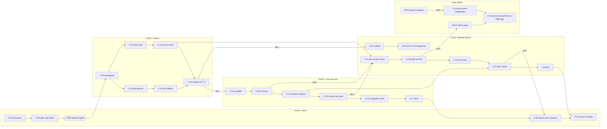

# Step plan

**Status**: approved by the owner on 2026-10-06 (task T029) | **Written**: 2026-10-06 | **Primary source**: `C:\MyWork\stepwise_identity`

One plan for all six tracks. Every step is one commit in the repository of its track; it builds, passes
its tests, includes its documentation and leaves the repository working. No implementation step marked
"this phase" and not yet done starts before the owner approves this plan.

## How to read this plan

- **Step ID** is `<track>-<nn>`. The `[T###]` prefix in the Objective column is the matching task in
  `specs/001-identity-platform-build/tasks.md` (in `anchorpoint.identity.gateway`).
- **Tracks**: C = shared library (`anchorpoint.lib.infrastructure`), U = User Service
  (`anchorpoint.service.user`), I = Identity Server (`anchorpoint.identity.gateway`), P = platform docs
  (`anchorpoint.docs`), M = Tenant Middleware (`anchorpoint.middleware.api-`), W = Demo Web App
  (`anchorpoint.agent.portal.mvc`).
- **Phases**: **Done** = already committed. **This phase** = C, U, I and the documentation in P.
  **Later** = M and W, and the steps that integrate with them.
- Commit messages use Conventional Commits with the track scope: `feat(infra)`, `feat(user)`,
  `feat(idsrv)`, `feat(tenant)`, `feat(web)`, `docs(platform)`, plus `chore`, `test`, `build`.
- "Docs produced" lists documents created or updated beyond the always-present step document,
  `docs/steps/README.md` entry and `CHANGELOG.md` entry.

## Step table

### Track P: platform documentation

| Step ID | Track | Objective | Depends on | Commit message | Can run in parallel with | Docs produced |
|---------|-------|-----------|------------|----------------|--------------------------|---------------|
| P-01 | P | [T004] Documentation repository baseline (**done**) | none | `docs(platform): add documentation repository baseline` | C-01, U-01, I-01 | README, folder structure, backlog |
| P-02 | P | [T008] Docs CI: link check, Mermaid check, secret scan (**done**) | P-01 | `build: add docs CI checks` | C-02, U-02, I-02 | none |
| P-03 | P | [T009] Step and step-report templates (**done**) | P-01 | `docs(platform): add step and step-report templates` | C-03, U-03, I-03 | `docs/process/*` |
| P-04 | P | [T011-T018] Discovery of the source projects (**done**) | P-03 | `docs(platform): add discovery of source projects` | none | `docs/discovery/*` (7 documents) |
| P-05 | P | [T019-T029] Step plan and ADR-001 to ADR-007; owner approval gate (**this step**) | P-04 | `docs(platform): add step plan and ADRs` | none | `docs/step-plan.md`, `docs/adr/ADR-001` to `ADR-007` |
| P-06 | P | [T074] Platform overview with the sequence diagram W to I to U to M | P-05 | `docs(platform): add platform overview` | C-04 to C-16 | `docs/platform/platform-overview.md` |
| P-07 | P | [T075, T076] Repository map and glossary | P-05 | `docs(platform): add repository map and glossary` | any C, U, I step | `docs/platform/repo-map.md`, `docs/platform/glossary.md` |
| P-08 | P | [T068] End-to-end compose: PostgreSQL, User Service, Identity Server, provider stand-in, Tenant Middleware double | U-16, I-14 | `docs(platform): add end-to-end compose` | I-15 | `compose/README.md`; test scenarios cross-linked |
| P-09 | P | [T077] Service catalog linking each service's step index and story, with reading order | P-07, C-16, U-17, I-19 | `docs(platform): add service catalog` | P-10 | `docs/platform/service-catalog.md` |
| P-10 | P | [T078] Local-run guide, verified literally | P-08, I-19 | `docs(platform): add local-run guide` | P-09 | `docs/platform/local-run-guide.md` |
| P-11 | P | [T079] Milestone tracker (updated at every integration milestone) | P-06 | `docs(platform): add milestone tracker` | any | `docs/platform/milestone-tracker.md` |
| P-12 | P | [T080] Cross-repository link check tool and CI wiring | P-09 | `build: add cross-repository link check` | P-11 | `tools/check-links.ps1` |
| P-13 | P | [T085] Rule: a change to `src/` needs a step document and changelog entry (script reused by service repos) | P-12 | `build: add step documentation rule` | C-17, U-18, I-20 | `tools/check-step-docs.ps1` |
| P-14 | P | [T081] Reviewer trial of the step documents | P-10, U-17, I-19 | `docs(platform): record reviewer trial` | none | `docs/process/review-trial-1.md` |
| P-15 | P | [T086-T091] Verification records and final documentation pass (secret scan, dual mode, migrations, quickstart, failure policy, link check) | all this-phase steps | `docs(platform): record phase verification` | none | `docs/process/*` verification records |

### Track C: Libraries.Infrastructure

| Step ID | Track | Objective | Depends on | Commit message | Can run in parallel with | Docs produced |
|---------|-------|-----------|------------|----------------|--------------------------|---------------|
| C-01 | C | [T003] Repository baseline (**done**) | none | `chore: add repository baseline` | P-01, U-01, I-01 | backlog, ADR and components folders |
| C-02 | C | [T005] CI: build, test, pack, secret scan (**done**) | C-01 | `build: add GitHub Actions CI` | P-02, U-02, I-02 | none |
| C-03 | C | [T010] Pull-request template (**done**) | C-01 | `chore: add pull-request template with definition of done` | P-03, U-03, I-03 | none |
| C-04 | C | [T030] Packaging: `Versions.props`, local pack script, SemVer source, tag-triggered release workflow to GitHub Packages, skeleton README and architecture | C-01, P-05 | `build: add packaging and versioning` | P-06, P-07 | `README.md`, `docs/architecture.md`, `docs/consuming.md`, `docs/versioning-and-release.md` (skeletons) |
| C-05 | C | [T031] Logging component (Serilog, correlation enrichment) | C-04 | `feat(infra): add logging component` | C-06 | `docs/components/logging.md` |
| C-06 | C | [T032] Configuration component (options with fail-fast validation) | C-04 | `feat(infra): add configuration component` | C-05 | `docs/components/configuration.md` |
| C-07 | C | [T033] Error handling (result model, ProblemDetails middleware) | C-04, C-06 | `feat(infra): add error handling component` | C-05 | `docs/components/errors.md` |
| C-08 | C | [T034] Correlation IDs: middleware and propagation | C-05, C-06 | `feat(infra): add correlation ids` | C-07 | `docs/components/correlation.md` |
| C-09 | C | [T035] Typed HTTP client with timeout, retries, circuit breaker | C-08 | `feat(infra): add resilient http client` | C-10 (after C-08) | `docs/components/http-client.md` |
| C-10 | C | [T036] Service credentials: client-credentials token client with cache | C-09, C-06 | `feat(infra): add service credential client` | C-11 | `docs/components/service-auth.md` |
| C-11 | C | [T037] Auth helpers: JWT bearer, scope policies, identity context | C-06, C-07 | `feat(infra): add auth helpers` | C-10 | `docs/components/auth.md` |
| C-12 | C | [T038] Health checks | C-06 | `feat(infra): add health checks` | C-13 | `docs/components/health-checks.md` |
| C-13 | C | [T039] Observability (OpenTelemetry wiring) | C-06, C-08 | `feat(infra): add observability` | C-12 | `docs/components/observability.md` |
| C-14 | C | [T040] Persistence: Npgsql, snake_case conventions, migration helper (ADR-005) | C-06, P-05 | `feat(infra): add persistence component` | C-12, C-13 | `docs/components/persistence.md` |
| C-15 | C | [T041] Test utilities: Testcontainers PostgreSQL, WebApplicationFactory helpers | C-14, C-11, C-05 | `feat(infra): add test utilities` | none | `docs/components/testing.md` |
| C-16 | C | [T042] Release v0.1.0 to GitHub Packages and complete library docs | C-05 to C-15 | `feat(infra): release v0.1.0` | none | `README.md`, `docs/architecture.md`, `docs/configuration.md`, `docs/operations.md`, `docs/testing.md`, `docs/service-story.md`, `consuming.md`, `versioning-and-release.md` |
| C-17 | C | [T082] Commit-message check | C-02 | `build: add commit message check` | U-18, I-20 | none |

### Track U: User Service

| Step ID | Track | Objective | Depends on | Commit message | Can run in parallel with | Docs produced |
|---------|-------|-----------|------------|----------------|--------------------------|---------------|
| U-01 | U | [T002] Repository baseline (**done**) | none | `chore: add repository baseline` | P-01, C-01, I-01 | backlog |
| U-02 | U | [T006] CI (**done**) | U-01 | `build: add GitHub Actions CI` | C-02, I-02 | none |
| U-03 | U | [T010] Pull-request template (**done**) | U-01 | `chore: add pull-request template with definition of done` | C-03, I-03 | none |
| U-04 | U | [T043] Scaffold projects, both solutions, health and logging via the library | C-16, U-01 | `feat(user): scaffold user service` | I-04 | `README.md`, `docs/architecture.md`, `docs/configuration.md` (skeletons) |
| U-05 | U | [T044] Contract DTOs: `ProfileLookupRequest`, `UserProfile`, `Problem` | U-04, P-04 | `feat(user): add profile contract` | U-06, I-04 | `docs/api.md` (contract section) |
| U-06 | U | [T045] Domain model: User, ExternalIdentity, Role, UserRole | U-04 | `feat(user): add domain model` | U-05 | `docs/data-model.md` |
| U-07 | U | [T046] EF Core and Npgsql data layer; initial PostgreSQL migration | U-06, C-14, C-15 | `feat(user): add data layer and initial migration` | none | `docs/database.md` |
| U-08 | U | [T047] Deterministic seed data | U-07 | `feat(user): add seed data` | U-09 | `docs/stub-data.md` |
| U-09 | U | [T048] Tenant Middleware contract DTOs (temporary home) | U-04 | `feat(user): add tenant middleware contract` | U-08 | backlog item to move to Track M |
| U-10 | U | [T049] Typed Tenant Middleware client, fail closed | U-09, C-09, C-10 | `feat(user): add tenant middleware client` | U-11 | none |
| U-11 | U | [T050] Tenant Middleware test double | U-09 | `test: add tenant middleware double` | U-10 | none |
| U-12 | U | [T051] Profile lookup endpoint (match by provider and provider id; 404, 503) | U-05, U-08, U-10 | `feat(user): add profile lookup endpoint` | none | `docs/api.md` |
| U-13 | U | [T052] Secure the endpoint with scope `user.read` | U-12, C-11 | `feat(user): secure profile endpoint` | none | `docs/security.md` |
| U-14 | U | [T053] Caching rule for the U to M hop per ADR-003 | U-10, P-05 | `feat(user): apply tenant data caching rule` | U-13 | `docs/api.md` caching note |
| U-15 | U | [T054] Integration tests against real PostgreSQL | U-11, U-13 | `test: add profile lookup integration tests` | none | `docs/testing.md` |
| U-16 | U | [T055] Dockerfile and compose | U-15 | `build: add dockerfile and compose` | I-18 | `docs/operations.md` |
| U-17 | U | [T056] Complete User Service documentation | U-16 | `docs(platform): complete user service docs` | I-19 | `README.md`, `docs/architecture.md`, `docs/configuration.md`, `docs/testing.md`, `docs/service-story.md`, step index |
| U-18 | U | [T083] Commit-message check | U-02 | `build: add commit message check` | C-17, I-20 | none |
| U-19 | U | Later: switch from the Tenant Middleware double to the real service | M-05, U-16 | `feat(user): integrate real tenant middleware` | none | `docs/api.md`, platform overview update |

### Track I: Identity Server

| Step ID | Track | Objective | Depends on | Commit message | Can run in parallel with | Docs produced |
|---------|-------|-----------|------------|----------------|--------------------------|---------------|
| I-01 | I | [T001] Repository baseline (**done**) | none | `chore: add repository baseline` | P-01, C-01, U-01 | backlog (Duende licence item) |
| I-02 | I | [T007] CI (**done**) | I-01 | `build: add GitHub Actions CI` | C-02, U-02 | none |
| I-03 | I | [T010] Pull-request template (**done**) | I-01 | `chore: add pull-request template with definition of done` | C-03, U-03 | none |
| I-04 | I | [T057] Scaffold host (Duende, in-memory stores), both solutions | C-16, I-01 | `feat(idsrv): scaffold identity server` | U-04 | `README.md`, `docs/architecture.md`, `docs/configuration.md` (skeletons) |
| I-05 | I | [T058] PostgreSQL and compose | I-04 | `feat(idsrv): add postgresql and compose` | U-05 | `docs/operations.md` (start section) |
| I-06 | I | [T059] Duende configuration and operational stores on Npgsql; regenerated migrations | I-05, C-14, C-15 | `feat(idsrv): add duende stores on postgresql` | none | `docs/database.md` |
| I-07 | I | [T060] Seeding: test client and service clients | I-06 | `feat(idsrv): seed clients` | I-08 | `docs/clients-and-scopes.md` |
| I-08 | I | [T061] Signing keys from outside the repository, with rotation | I-06 | `feat(idsrv): add signing key management` | I-07 | `docs/security.md` (rotation) |
| I-09 | I | [T062] External provider selection, Entra ID first, persisted providers | I-06 | `feat(idsrv): add external provider selection` | I-10 | `docs/configuration.md` |
| I-10 | I | [T063] Local external provider stand-in for tests | I-04 | `test: add external provider stand-in` | I-09 | `docs/test-scenarios.md` |
| I-11 | I | [T064] User Service client (client credentials, scope `user.read`, no cache) | I-04, U-05, U-13, C-09, C-10 | `feat(idsrv): add user service client` | none | `docs/clients-and-scopes.md` |
| I-12 | I | [T065] Profile service and claims mapping | I-11, I-09 | `feat(idsrv): add profile service and claims mapping` | none | `docs/claims-mapping.md` |
| I-13 | I | [T066] Fail-closed sign-in: not provisioned, upstream unavailable | I-12, P-05 | `feat(idsrv): refuse sign-in when profile unavailable` | none | `docs/claims-mapping.md` failure section |
| I-14 | I | [T067] Sign-in integration tests | I-10, I-13, U-12 | `test: add sign-in integration tests` | none | `docs/testing.md` |
| I-15 | I | [T069] Observability and health | I-12 | `feat(idsrv): add observability and health` | I-16 | `docs/operations.md` (diagnose by correlation id) |
| I-16 | I | [T070] Hardening: CORS, cookies, headers, secrets | I-13 | `feat(idsrv): add hardening` | I-15 | `docs/security.md` |
| I-17 | I | [T071] Licensing documentation and backlog | I-04 | `docs(platform): document duende licensing status` | any | `docs/security.md`, `docs/operations.md` |
| I-18 | I | [T072] Dockerfile and image build in CI | I-14 | `build: add dockerfile` | U-16 | `docs/operations.md` |
| I-19 | I | [T073] Complete Identity Server documentation | I-14 to I-18 | `docs(platform): complete identity server docs` | U-17 | `README.md`, `docs/architecture.md`, `docs/testing.md`, `docs/service-story.md`, step index |
| I-20 | I | [T084] Commit-message check | I-02 | `build: add commit message check` | C-17, U-18 | none |
| I-21 | I | Later: end-to-end sign-in from the Demo Web App against the full stack | I-19, W-03, U-19 | `docs(platform): verify end to end sign-in` | none | `docs/login-flow.md` cross-link |

### Track M: Tenant Middleware (later phase)

| Step ID | Track | Objective | Depends on | Commit message | Can run in parallel with | Docs produced |
|---------|-------|-----------|------------|----------------|--------------------------|---------------|
| M-01 | M | Baseline, CI, PR template, `.slnx` (folder `anchorpoint.middleware.api-`, confirmed) | P-05 | `chore: add repository baseline` | any | backlog, step index |
| M-02 | M | Scaffold service on library v0.1.0 | M-01, C-16 | `feat(tenant): scaffold tenant middleware` | none | README, architecture skeletons |
| M-03 | M | Move contract DTOs here from the User Service (U-09) and publish as package | M-02, U-09 | `feat(tenant): add contract package` | none | `docs/contract.md`, `docs/api.md` |
| M-04 | M | Stub data model and deterministic seed behind an interface | M-02 | `feat(tenant): add stub directory` | M-03 | `docs/stub-data.md`, `docs/tenant-and-group-model.md` |
| M-05 | M | Identity lookup endpoint secured with scope `tenant.read`; stub header `X-DIT-Data-Source: stub` | M-03, M-04, C-11 | `feat(tenant): add identity lookup endpoint` | none | `docs/api.md`, `docs/security.md` |
| M-06 | M | Integration tests, Dockerfile, CI, complete docs | M-05 | `feat(tenant): finish tenant middleware` | none | remaining required docs, service story |

### Track W: Demo Web App (later phase)

| Step ID | Track | Objective | Depends on | Commit message | Can run in parallel with | Docs produced |
|---------|-------|-----------|------------|----------------|--------------------------|---------------|
| W-01 | W | Baseline, CI, PR template, `.slnx`, scaffold MVC | C-16 | `feat(web): scaffold demo web app` | M-01 | README skeleton |
| W-02 | W | Sign-in with code and PKCE against the Identity Server's in-memory host | W-01, I-04 | `feat(web): add oidc sign-in` | none | `docs/login-flow.md` |
| W-03 | W | Claims page: all claims and token details | W-02, I-12 | `feat(web): add claims page` | none | `docs/test-scenarios.md` |
| W-04 | W | Role and group authorization demo pages | W-03 | `feat(web): add role and group pages` | none | `docs/test-scenarios.md` |
| W-05 | W | Sign-out and session handling | W-03 | `feat(web): add sign-out` | W-04 | `docs/login-flow.md` |
| W-06 | W | Optional call to a protected API with the access token | W-05 | `feat(web): add protected api call` | none | `docs/login-flow.md` |
| W-07 | W | Dockerfile, CI, screenshots, complete docs; non-production-only statement (ADR-007) | W-06 | `feat(web): finish demo web app` | none | README, architecture, configuration, operations, testing |

## Dependency graph

Only the dependencies that cross a track boundary or gate a phase are drawn. Dependencies inside one
track are the table's "Depends on" column. Dashed boxes are the later phase.

## Integration milestones

A milestone is a point where one track needs another track's finished step. Each is recorded in
`docs/platform/milestone-tracker.md` (step P-11) when it is reached.

| ID | Requirement | Meaning |
|----|-------------|---------|
| IM-0 | Every implementation step after P-05 requires the approval gate T029 | No building before the plan is approved |
| IM-1 | U-04 and I-04 require C-16 | Services build on released library v0.1.0, never on copied code |
| IM-2 | I-11 requires U-05 | The Identity Server's client is written against the published contract |
| IM-3 | I-11 and I-14 require U-13 (and U-12) | The Identity Server calls a real, secured User Service endpoint |
| IM-4 | P-08 requires U-16 and I-14 | Full-stack compose runs the real User Service and Identity Server |
| IM-5 (later) | U-19 requires M-05 | The test double is replaced by the real Tenant Middleware |
| IM-6 (later) | W-03 requires I-12 | The Demo Web App shows claims issued by the real profile service |
| ADR gates | C-14 requires ADR-005; U-14 and I-13 require ADR-003; C-04 requires ADR-001; C-10 requires ADR-002 | Decisions are recorded before the steps that depend on them |

## Documentation coverage matrix

Every required document has a named step that **creates** it (at least a useful skeleton) and a step that
**completes** it, so nothing is left to the end. Skeletons are created by each track's scaffold step.

### Every repository

| Document | Created in | Completed in |
|----------|------------|--------------|
| `README.md` | baseline (C-01, U-01, I-01, P-01) then scaffold step | C-16, U-17, I-19 |
| `docs/architecture.md` (Mermaid) | C-04, U-04, I-04 | C-16, U-17, I-19 |
| `docs/configuration.md` | C-06 (library), U-04, I-04 | C-16, U-17, I-19 |
| `docs/operations.md` | U-16, I-05 | C-16, U-16, I-18 |
| `docs/testing.md` | C-15, U-15, I-14 | C-16, U-17, I-19 |
| `docs/adr/` | baseline steps | P-05 (ADR-001 to ADR-007 live in `anchorpoint.docs`; service folders link to them) |
| `docs/steps/NN-*.md` | every step | every step |
| `CHANGELOG.md` | baseline steps | every step |
| `docs/backlog.md` | baseline steps | any step that defers something |

### Per service

| Service | Document | Created in | Completed in |
|---------|----------|------------|--------------|
| Library | `docs/components/<name>.md` | C-05 to C-15 (one each) | C-16 |
| Library | `docs/consuming.md`, `docs/versioning-and-release.md` | C-04 | C-16 |
| User Service | `docs/api.md` | U-05 | U-14 |
| User Service | `docs/data-model.md` | U-06 | U-06 |
| User Service | `docs/database.md` | U-07 | U-07 |
| User Service | `docs/security.md` | U-13 | U-13 |
| Identity Server | `docs/clients-and-scopes.md` | I-07 | I-11 |
| Identity Server | `docs/claims-mapping.md` | I-12 | I-13 |
| Identity Server | `docs/database.md` | I-06 | I-06 |
| Identity Server | `docs/security.md` | I-08 | I-17 |
| Tenant Middleware (later) | `docs/api.md`, `docs/contract.md`, `docs/stub-data.md`, `docs/tenant-and-group-model.md` | M-03 to M-05 | M-06 |
| Demo Web App (later) | `docs/login-flow.md`, `docs/test-scenarios.md`, README run instructions | W-02 | W-07 |
| Platform | `platform-overview.md` | P-06 | P-15 |
| Platform | repo map, glossary | P-07 | P-15 |
| Platform | service catalog | P-09 | P-15 |
| Platform | local-run guide | P-10 | P-15 |
| Platform | milestone tracker | P-11 | updated at every milestone |

## What the discovery changed in this plan

| Finding | Effect on the plan |
|---------|--------------------|
| Most Track C components have no source to port (only token client, resilience policies, identity context exist) | C-05 to C-08, C-11 to C-15 are new design, so each has its own step and test; no "port" shortcut |
| The source has no User Service to Tenant Middleware hop and no groups | U-09 to U-11 and U-14 are new work; M-03 to M-05 define the contract |
| Circular dependency in the source (id conversion callback) | The callback is dropped; recorded in `docs/discovery/mini-userservice-split.md` |
| PostgreSQL case sensitivity | ADR-005 decides it before C-14 and U-07 |
| The internal production persistence package has no PostgreSQL equivalent | C-14 builds it |
| `Libraries.Infrastructure` is proprietary | ADR-001 states the library is an original implementation; discovery documents are design reference only |

## Decisions taken at the approval gate (2026-10-06)

| Item | Decision |
|------|----------|
| Entra ID provider user ID | `oid` (ADR-003) |
| Package feed | GitHub Packages (ADR-001); owner name to be filled in when the repositories are pushed |
| Tenant Middleware folder | `anchorpoint.middleware.api-`, confirmed |
| ADR-001 to ADR-007 | Approved as proposed, now Accepted |
| CI system | GitHub Actions |

## Approval

Approved by the project owner on 2026-10-06. Implementation of the "this phase" steps may start, beginning with
C-04 (task T030). Changes to this plan after approval are recorded here with a date.
